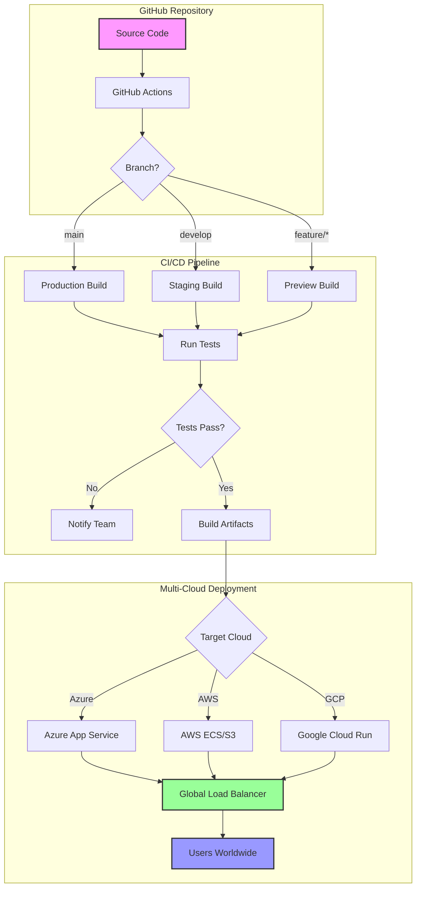
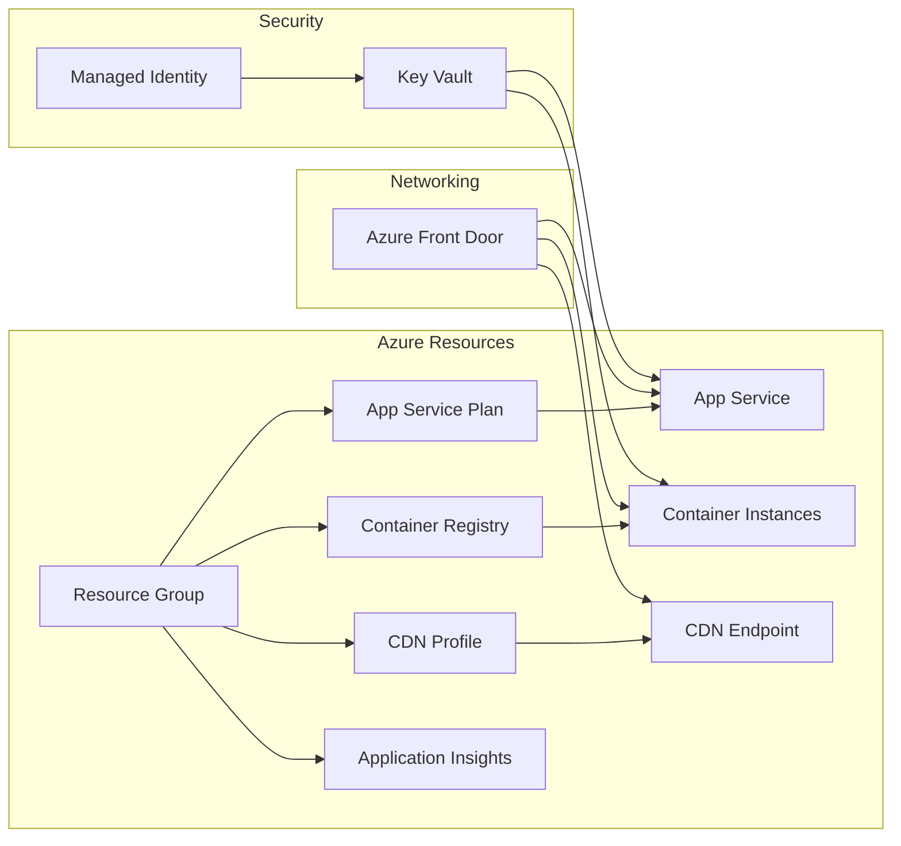
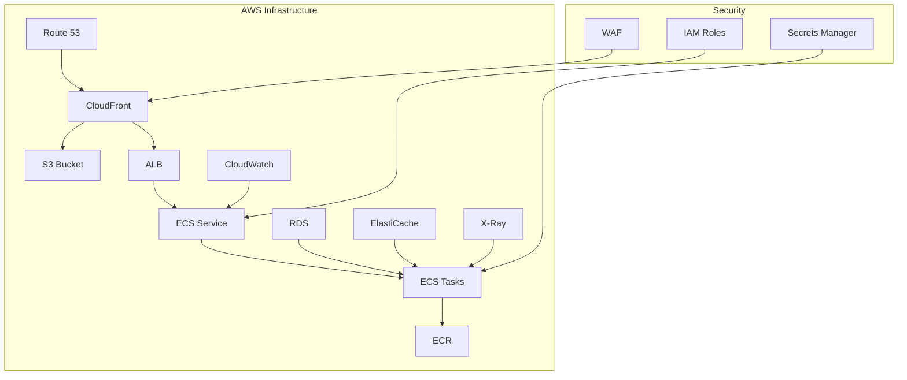
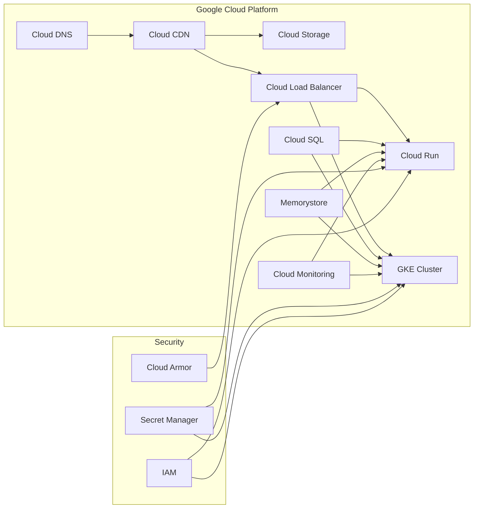
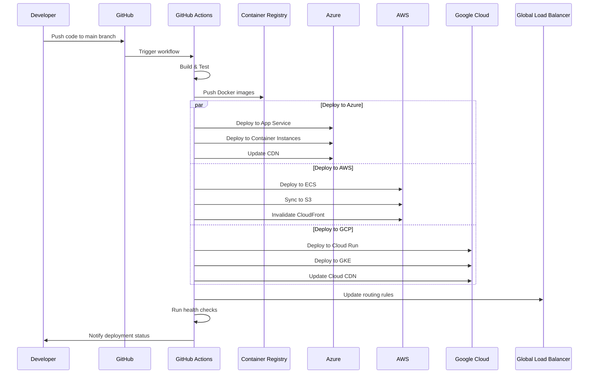
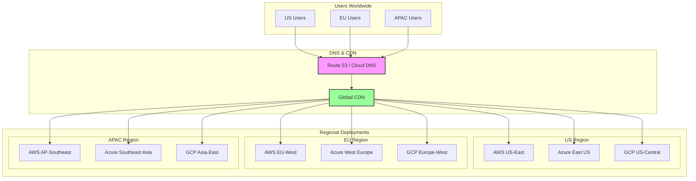
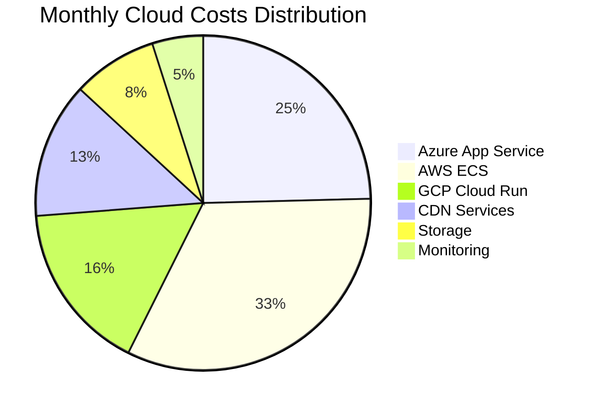

# 🚀 Multi-Cloud Deployment Guide

## 📍 You Are Here

You've completed all demos! Now let's deploy your projects to multiple cloud providers using GitHub Actions.

**Workshop Progress**: Setup ✓ → Demos ✓ → **Deployment** → Contributing

---

## 📋 Complete Multi-Cloud Deployment Example

### Full GitHub Actions Workflow for All Three Clouds

This example shows a complete workflow that deploys to Azure, AWS, and Google Cloud simultaneously:

```yaml
# .github/workflows/complete-multi-cloud-deploy.yml
name: Complete Multi-Cloud Deployment

on:
  push:
    branches: [main]
  pull_request:
    branches: [main]
  workflow_dispatch:
    inputs:
      environment:
        description: 'Deployment environment'
        required: true
        default: 'production'
        type: choice
        options:
          - development
          - staging
          - production

env:
  NODE_VERSION: '18'
  DOCKER_BUILDKIT: 1

jobs:
  # ==================== SHARED BUILD ====================
  build-and-test:
    name: Build and Test All Applications
    runs-on: ubuntu-latest
    outputs:
      version: ${{ steps.version.outputs.version }}
      docker-tag: ${{ steps.docker.outputs.tag }}
      
    steps:
      - name: Checkout repository
        uses: actions/checkout@v4
        with:
          fetch-depth: 0
      
      - name: Setup Node.js
        uses: actions/setup-node@v4
        with:
          node-version: ${{ env.NODE_VERSION }}
          cache: 'npm'
      
      - name: Generate version number
        id: version
        run: |
          echo "version=$(date +%Y%m%d.%H%M%S)-${GITHUB_SHA::8}" >> $GITHUB_OUTPUT
          echo "Generated version: $(date +%Y%m%d.%H%M%S)-${GITHUB_SHA::8}"
      
      - name: Install dependencies
        run: |
          npm ci --prefer-offline --no-audit
          npm run install:all
      
      - name: Run quality checks
        run: |
          npm run lint:all
          npm run test:all -- --coverage
          npm run test:e2e
      
      - name: Build all projects
        run: |
          npm run build:all
          echo "Build completed successfully"
      
      - name: Build Docker images
        id: docker
        run: |
          # Build multi-stage Docker image
          docker build \
            --build-arg NODE_VERSION=${{ env.NODE_VERSION }} \
            --build-arg BUILD_DATE=$(date -u +'%Y-%m-%dT%H:%M:%SZ') \
            --build-arg VCS_REF=${GITHUB_SHA::8} \
            --build-arg VERSION=${{ steps.version.outputs.version }} \
            -t figma-to-code:${{ steps.version.outputs.version }} \
            -t figma-to-code:latest \
            .
          
          echo "tag=${{ steps.version.outputs.version }}" >> $GITHUB_OUTPUT
      
      - name: Save Docker image
        run: |
          docker save figma-to-code:${{ steps.version.outputs.version }} | gzip > figma-to-code.tar.gz
      
      - name: Upload artifacts
        uses: actions/upload-artifact@v3
        with:
          name: deployment-artifacts
          path: |
            dist/
            build/
            .next/
            public/
            figma-to-code.tar.gz
          retention-days: 7

  # ==================== AZURE DEPLOYMENT ====================
  deploy-azure:
    name: Deploy to Microsoft Azure
    needs: build-and-test
    runs-on: ubuntu-latest
    if: github.event_name == 'push' && github.ref == 'refs/heads/main'
    environment:
      name: azure-${{ github.event.inputs.environment || 'production' }}
      url: https://azure.figma-to-code.dev
      
    steps:
      - name: Download artifacts
        uses: actions/download-artifact@v3
        with:
          name: deployment-artifacts
      
      - name: Load Docker image
        run: |
          gunzip -c figma-to-code.tar.gz | docker load
      
      - name: Login to Azure
        uses: azure/login@v1
        with:
          creds: ${{ secrets.AZURE_CREDENTIALS }}
      
      - name: Login to Azure Container Registry
        uses: azure/docker-login@v1
        with:
          login-server: ${{ secrets.AZURE_ACR_NAME }}.azurecr.io
          username: ${{ secrets.AZURE_ACR_USERNAME }}
          password: ${{ secrets.AZURE_ACR_PASSWORD }}
      
      - name: Push to Azure Container Registry
        run: |
          docker tag figma-to-code:${{ needs.build-and-test.outputs.version }} \
            ${{ secrets.AZURE_ACR_NAME }}.azurecr.io/figma-to-code:${{ needs.build-and-test.outputs.version }}
          
          docker push ${{ secrets.AZURE_ACR_NAME }}.azurecr.io/figma-to-code:${{ needs.build-and-test.outputs.version }}
      
      - name: Deploy to Azure App Service
        uses: azure/webapps-deploy@v2
        with:
          app-name: ${{ secrets.AZURE_WEBAPP_NAME }}
          images: ${{ secrets.AZURE_ACR_NAME }}.azurecr.io/figma-to-code:${{ needs.build-and-test.outputs.version }}
      
      - name: Update Azure CDN
        run: |
          az cdn endpoint purge \
            --resource-group ${{ secrets.AZURE_RESOURCE_GROUP }} \
            --profile-name ${{ secrets.AZURE_CDN_PROFILE }} \
            --name ${{ secrets.AZURE_CDN_ENDPOINT }} \
            --content-paths "/*" \
            --no-wait

  # ==================== AWS DEPLOYMENT ====================
  deploy-aws:
    name: Deploy to Amazon Web Services
    needs: build-and-test
    runs-on: ubuntu-latest
    if: github.event_name == 'push' && github.ref == 'refs/heads/main'
    environment:
      name: aws-${{ github.event.inputs.environment || 'production' }}
      url: https://aws.figma-to-code.dev
      
    steps:
      - name: Checkout repository
        uses: actions/checkout@v4
      
      - name: Download artifacts
        uses: actions/download-artifact@v3
        with:
          name: deployment-artifacts
      
      - name: Load Docker image
        run: |
          gunzip -c figma-to-code.tar.gz | docker load
      
      - name: Configure AWS credentials
        uses: aws-actions/configure-aws-credentials@v4
        with:
          aws-access-key-id: ${{ secrets.AWS_ACCESS_KEY_ID }}
          aws-secret-access-key: ${{ secrets.AWS_SECRET_ACCESS_KEY }}
          aws-region: ${{ secrets.AWS_REGION }}
      
      - name: Login to Amazon ECR
        id: login-ecr
        uses: aws-actions/amazon-ecr-login@v2
      
      - name: Push to Amazon ECR
        env:
          ECR_REGISTRY: ${{ steps.login-ecr.outputs.registry }}
          ECR_REPOSITORY: figma-to-code-workshop
        run: |
          docker tag figma-to-code:${{ needs.build-and-test.outputs.version }} \
            $ECR_REGISTRY/$ECR_REPOSITORY:${{ needs.build-and-test.outputs.version }}
          
          docker push $ECR_REGISTRY/$ECR_REPOSITORY:${{ needs.build-and-test.outputs.version }}
      
      - name: Deploy static assets to S3
        run: |
          aws s3 sync dist/ s3://${{ secrets.AWS_S3_BUCKET }}/ \
            --delete \
            --cache-control "public, max-age=31536000, immutable" \
            --exclude "*.html" \
            --exclude "*.json"
          
          aws s3 sync dist/ s3://${{ secrets.AWS_S3_BUCKET }}/ \
            --cache-control "public, max-age=3600, must-revalidate" \
            --exclude "*" \
            --include "*.html" \
            --include "*.json"
      
      - name: Update ECS Task Definition
        id: task-def
        uses: aws-actions/amazon-ecs-render-task-definition@v1
        with:
          task-definition: ecs-task-definition.json
          container-name: figma-to-code-app
          image: ${{ steps.login-ecr.outputs.registry }}/figma-to-code-workshop:${{ needs.build-and-test.outputs.version }}
      
      - name: Deploy to Amazon ECS
        uses: aws-actions/amazon-ecs-deploy-task-definition@v1
        with:
          task-definition: ${{ steps.task-def.outputs.task-definition }}
          service: ${{ secrets.AWS_ECS_SERVICE }}
          cluster: ${{ secrets.AWS_ECS_CLUSTER }}
          wait-for-service-stability: true
      
      - name: Invalidate CloudFront
        run: |
          aws cloudfront create-invalidation \
            --distribution-id ${{ secrets.AWS_CLOUDFRONT_DISTRIBUTION_ID }} \
            --paths "/*"

  # ==================== GOOGLE CLOUD DEPLOYMENT ====================
  deploy-gcp:
    name: Deploy to Google Cloud Platform
    needs: build-and-test
    runs-on: ubuntu-latest
    if: github.event_name == 'push' && github.ref == 'refs/heads/main'
    environment:
      name: gcp-${{ github.event.inputs.environment || 'production' }}
      url: https://gcp.figma-to-code.dev
      
    steps:
      - name: Checkout repository
        uses: actions/checkout@v4
      
      - name: Download artifacts
        uses: actions/download-artifact@v3
        with:
          name: deployment-artifacts
      
      - name: Load Docker image
        run: |
          gunzip -c figma-to-code.tar.gz | docker load
      
      - name: Authenticate to Google Cloud
        uses: google-github-actions/auth@v1
        with:
          credentials_json: ${{ secrets.GCP_SA_KEY }}
      
      - name: Setup Google Cloud SDK
        uses: google-github-actions/setup-gcloud@v1
      
      - name: Configure Docker for GCR
        run: |
          gcloud auth configure-docker gcr.io
      
      - name: Push to Google Container Registry
        run: |
          docker tag figma-to-code:${{ needs.build-and-test.outputs.version }} \
            gcr.io/${{ secrets.GCP_PROJECT_ID }}/figma-to-code:${{ needs.build-and-test.outputs.version }}
          
          docker push gcr.io/${{ secrets.GCP_PROJECT_ID }}/figma-to-code:${{ needs.build-and-test.outputs.version }}
      
      - name: Deploy to Cloud Run
        run: |
          gcloud run deploy figma-to-code-service \
            --image gcr.io/${{ secrets.GCP_PROJECT_ID }}/figma-to-code:${{ needs.build-and-test.outputs.version }} \
            --platform managed \
            --region ${{ secrets.GCP_REGION }} \
            --allow-unauthenticated \
            --port 3000 \
            --memory 2Gi \
            --cpu 2 \
            --max-instances 100 \
            --min-instances 1 \
            --set-env-vars NODE_ENV=production
      
      - name: Deploy static assets to Cloud Storage
        run: |
          gsutil -m rsync -r -d dist/ gs://${{ secrets.GCP_BUCKET_NAME }}/
          
          # Set cache headers for static assets
          gsutil -m setmeta -h "Cache-Control:public, max-age=31536000, immutable" \
            "gs://${{ secrets.GCP_BUCKET_NAME }}/**/*.js" \
            "gs://${{ secrets.GCP_BUCKET_NAME }}/**/*.css" \
            "gs://${{ secrets.GCP_BUCKET_NAME }}/**/*.woff2"
      
      - name: Update Cloud CDN
        run: |
          gcloud compute url-maps invalidate-cdn-cache ${{ secrets.GCP_URL_MAP_NAME }} \
            --path "/*" \
            --async

  # ==================== HEALTH CHECKS & NOTIFICATIONS ====================
  verify-deployments:
    name: Verify All Deployments
    needs: [deploy-azure, deploy-aws, deploy-gcp]
    runs-on: ubuntu-latest
    if: always()
    
    steps:
      - name: Check Azure Health
        if: needs.deploy-azure.result == 'success'
        run: |
          for i in {1..5}; do
            response=$(curl -s -o /dev/null -w "%{http_code}" https://azure.figma-to-code.dev/health || echo "000")
            if [ "$response" = "200" ]; then
              echo "✅ Azure deployment is healthy"
              break
            fi
            echo "⏳ Waiting for Azure deployment... (attempt $i/5)"
            sleep 30
          done
      
      - name: Check AWS Health
        if: needs.deploy-aws.result == 'success'
        run: |
          for i in {1..5}; do
            response=$(curl -s -o /dev/null -w "%{http_code}" https://aws.figma-to-code.dev/health || echo "000")
            if [ "$response" = "200" ]; then
              echo "✅ AWS deployment is healthy"
              break
            fi
            echo "⏳ Waiting for AWS deployment... (attempt $i/5)"
            sleep 30
          done
      
      - name: Check GCP Health
        if: needs.deploy-gcp.result == 'success'
        run: |
          for i in {1..5}; do
            response=$(curl -s -o /dev/null -w "%{http_code}" https://gcp.figma-to-code.dev/health || echo "000")
            if [ "$response" = "200" ]; then
              echo "✅ GCP deployment is healthy"
              break
            fi
            echo "⏳ Waiting for GCP deployment... (attempt $i/5)"
            sleep 30
          done
      
      - name: Send deployment notification
        if: always()
        uses: 8398a7/action-slack@v3
        with:
          status: custom
          custom_payload: |
            {
              text: "Multi-Cloud Deployment Status",
              attachments: [{
                color: '${{ contains(needs.*.result, 'failure') && 'danger' || 'good' }}',
                fields: [
                  { title: "Version", value: "${{ needs.build-and-test.outputs.version }}", short: true },
                  { title: "Environment", value: "${{ github.event.inputs.environment || 'production' }}", short: true },
                  { title: "Azure", value: "${{ needs.deploy-azure.result }}", short: true },
                  { title: "AWS", value: "${{ needs.deploy-aws.result }}", short: true },
                  { title: "GCP", value: "${{ needs.deploy-gcp.result }}", short: true },
                  { title: "Triggered by", value: "${{ github.actor }}", short: true }
                ]
              }]
            }
        env:
          SLACK_WEBHOOK_URL: ${{ secrets.SLACK_WEBHOOK }}
```

---

## 🌐 Multi-Cloud Architecture Overview



---

## 🚀 GitHub Actions Multi-Cloud CI/CD

### Master Workflow Configuration

```yaml
# .github/workflows/multi-cloud-deploy.yml
name: Multi-Cloud Deployment Pipeline

on:
  push:
    branches: [main, develop]
  pull_request:
    branches: [main]
  workflow_dispatch:
    inputs:
      target_cloud:
        description: 'Target cloud provider'
        required: true
        default: 'all'
        type: choice
        options:
          - all
          - azure
          - aws
          - gcp

env:
  NODE_VERSION: '18'
  DOCKER_REGISTRY: ghcr.io
  IMAGE_NAME: ${{ github.repository }}

jobs:
  # ==================== BUILD & TEST ====================
  build-and-test:
    name: Build and Test Applications
    runs-on: ubuntu-latest
    outputs:
      version: ${{ steps.version.outputs.version }}
      
    steps:
      - name: Checkout code
        uses: actions/checkout@v4
        
      - name: Setup Node.js
        uses: actions/setup-node@v4
        with:
          node-version: ${{ env.NODE_VERSION }}
          cache: 'npm'
          
      - name: Generate version
        id: version
        run: echo "version=$(date +%Y%m%d)-${{ github.run_number }}" >> $GITHUB_OUTPUT
        
      - name: Install dependencies
        run: npm ci
        
      - name: Run linting
        run: npm run lint:all
        
      - name: Run tests
        run: npm run test:all
        
      - name: Build all projects
        run: npm run build:all
        
      - name: Build Docker images
        run: |
          docker build -t ${{ env.DOCKER_REGISTRY }}/${{ env.IMAGE_NAME }}:${{ steps.version.outputs.version }} .
          docker build -t ${{ env.DOCKER_REGISTRY }}/${{ env.IMAGE_NAME }}:latest .
          
      - name: Login to GitHub Container Registry
        uses: docker/login-action@v3
        with:
          registry: ${{ env.DOCKER_REGISTRY }}
          username: ${{ github.actor }}
          password: ${{ secrets.GITHUB_TOKEN }}
          
      - name: Push Docker images
        run: |
          docker push ${{ env.DOCKER_REGISTRY }}/${{ env.IMAGE_NAME }}:${{ steps.version.outputs.version }}
          docker push ${{ env.DOCKER_REGISTRY }}/${{ env.IMAGE_NAME }}:latest
          
      - name: Upload build artifacts
        uses: actions/upload-artifact@v3
        with:
          name: build-artifacts
          path: |
            dist/
            build/
            .next/
            public/

  # ==================== AZURE DEPLOYMENT ====================
  deploy-azure:
    name: Deploy to Azure
    needs: build-and-test
    if: github.ref == 'refs/heads/main' && (github.event.inputs.target_cloud == 'all' || github.event.inputs.target_cloud == 'azure')
    runs-on: ubuntu-latest
    environment:
      name: azure-production
      url: https://azure.figma-to-code.dev
      
    steps:
      - name: Checkout code
        uses: actions/checkout@v4
        
      - name: Download artifacts
        uses: actions/download-artifact@v3
        with:
          name: build-artifacts
          
      - name: Login to Azure
        uses: azure/login@v1
        with:
          creds: ${{ secrets.AZURE_CREDENTIALS }}
          
      - name: Deploy to Azure App Service
        uses: azure/webapps-deploy@v2
        with:
          app-name: figma-to-code-workshop
          package: .
          
      - name: Deploy to Azure Container Instances
        uses: azure/aci-deploy@v1
        with:
          resource-group: figma-to-code-rg
          dns-name-label: figma-to-code
          image: ${{ env.DOCKER_REGISTRY }}/${{ env.IMAGE_NAME }}:${{ needs.build-and-test.outputs.version }}
          location: 'eastus'
          
      - name: Configure Azure CDN
        run: |
          az cdn endpoint purge \
            --resource-group figma-to-code-rg \
            --profile-name figma-to-code-cdn \
            --name figma-to-code-endpoint \
            --content-paths "/*"

  # ==================== AWS DEPLOYMENT ====================
  deploy-aws:
    name: Deploy to AWS
    needs: build-and-test
    if: github.ref == 'refs/heads/main' && (github.event.inputs.target_cloud == 'all' || github.event.inputs.target_cloud == 'aws')
    runs-on: ubuntu-latest
    environment:
      name: aws-production
      url: https://aws.figma-to-code.dev
      
    steps:
      - name: Checkout code
        uses: actions/checkout@v4
        
      - name: Download artifacts
        uses: actions/download-artifact@v3
        with:
          name: build-artifacts
          
      - name: Configure AWS credentials
        uses: aws-actions/configure-aws-credentials@v4
        with:
          aws-access-key-id: ${{ secrets.AWS_ACCESS_KEY_ID }}
          aws-secret-access-key: ${{ secrets.AWS_SECRET_ACCESS_KEY }}
          aws-region: us-east-1
          
      - name: Login to Amazon ECR
        id: login-ecr
        uses: aws-actions/amazon-ecr-login@v2
        
      - name: Deploy to S3 and CloudFront
        run: |
          # Sync static files to S3
          aws s3 sync dist/ s3://${{ secrets.AWS_S3_BUCKET }} --delete
          
          # Invalidate CloudFront cache
          aws cloudfront create-invalidation \
            --distribution-id ${{ secrets.AWS_CLOUDFRONT_DISTRIBUTION_ID }} \
            --paths "/*"
            
      - name: Deploy to ECS
        run: |
          # Update task definition
          aws ecs register-task-definition \
            --family figma-to-code-task \
            --container-definitions file://ecs-task-definition.json
            
          # Update service
          aws ecs update-service \
            --cluster figma-to-code-cluster \
            --service figma-to-code-service \
            --task-definition figma-to-code-task:latest

  # ==================== GOOGLE CLOUD DEPLOYMENT ====================
  deploy-gcp:
    name: Deploy to Google Cloud
    needs: build-and-test
    if: github.ref == 'refs/heads/main' && (github.event.inputs.target_cloud == 'all' || github.event.inputs.target_cloud == 'gcp')
    runs-on: ubuntu-latest
    environment:
      name: gcp-production
      url: https://gcp.figma-to-code.dev
      
    steps:
      - name: Checkout code
        uses: actions/checkout@v4
        
      - name: Download artifacts
        uses: actions/download-artifact@v3
        with:
          name: build-artifacts
          
      - name: Setup Google Cloud SDK
        uses: google-github-actions/setup-gcloud@v1
        with:
          service_account_key: ${{ secrets.GCP_SA_KEY }}
          project_id: ${{ secrets.GCP_PROJECT_ID }}
          
      - name: Configure Docker for GCR
        run: gcloud auth configure-docker
        
      - name: Deploy to Cloud Run
        run: |
          gcloud run deploy figma-to-code-workshop \
            --image ${{ env.DOCKER_REGISTRY }}/${{ env.IMAGE_NAME }}:${{ needs.build-and-test.outputs.version }} \
            --platform managed \
            --region us-central1 \
            --allow-unauthenticated
            
      - name: Deploy to App Engine
        run: |
          gcloud app deploy app.yaml \
            --version=${{ needs.build-and-test.outputs.version }} \
            --promote \
            --quiet
            
      - name: Update Cloud CDN
        run: |
          gcloud compute url-maps invalidate-cdn-cache figma-to-code-lb \
            --path="/*"

  # ==================== HEALTH CHECKS ====================
  health-check:
    name: Verify Deployments
    needs: [deploy-azure, deploy-aws, deploy-gcp]
    runs-on: ubuntu-latest
    
    steps:
      - name: Check Azure deployment
        run: |
          response=$(curl -s -o /dev/null -w "%{http_code}" https://azure.figma-to-code.dev/health)
          if [ $response -eq 200 ]; then
            echo "✅ Azure deployment is healthy"
          else
            echo "❌ Azure deployment failed"
            exit 1
          fi
          
      - name: Check AWS deployment
        run: |
          response=$(curl -s -o /dev/null -w "%{http_code}" https://aws.figma-to-code.dev/health)
          if [ $response -eq 200 ]; then
            echo "✅ AWS deployment is healthy"
          else
            echo "❌ AWS deployment failed"
            exit 1
          fi
          
      - name: Check GCP deployment
        run: |
          response=$(curl -s -o /dev/null -w "%{http_code}" https://gcp.figma-to-code.dev/health)
          if [ $response -eq 200 ]; then
            echo "✅ GCP deployment is healthy"
          else
            echo "❌ GCP deployment failed"
            exit 1
          fi
```

---

## ☁️ Cloud-Specific Configurations

### 🔷 Azure Deployment

#### Step-by-Step Azure Deployment Guide

##### Prerequisites
1. **Azure Account**: Create a free account at [azure.microsoft.com](https://azure.microsoft.com)
2. **Azure CLI**: Install from [docs.microsoft.com/cli/azure/install](https://docs.microsoft.com/cli/azure/install)
3. **Service Principal**: For GitHub Actions authentication

##### Step 1: Create Azure Service Principal
```bash
# Login to Azure
az login

# Create service principal for GitHub Actions
az ad sp create-for-rbac --name "github-actions-sp" \
  --role contributor \
  --scopes /subscriptions/{subscription-id} \
  --sdk-auth

# Save the output as AZURE_CREDENTIALS in GitHub Secrets
```

##### Step 2: Set Up Azure Resources
```bash
# Create resource group
az group create --name figma-to-code-rg --location eastus

# Create App Service Plan
az appservice plan create \
  --name figma-to-code-plan \
  --resource-group figma-to-code-rg \
  --sku P1V3 \
  --is-linux

# Create Web App
az webapp create \
  --name figma-to-code-workshop \
  --resource-group figma-to-code-rg \
  --plan figma-to-code-plan \
  --runtime "NODE:18-lts"

# Create Container Registry
az acr create \
  --name figmatocoderegistry \
  --resource-group figma-to-code-rg \
  --sku Standard \
  --admin-enabled true
```

##### Step 3: Configure GitHub Secrets
Add these secrets to your GitHub repository:
- `AZURE_CREDENTIALS`: Service principal JSON
- `AZURE_WEBAPP_NAME`: figma-to-code-workshop
- `AZURE_RESOURCE_GROUP`: figma-to-code-rg
- `AZURE_ACR_NAME`: figmatocoderegistry

##### Step 4: Deploy with GitHub Actions
```yaml
# .github/workflows/deploy-azure.yml
name: Deploy to Azure

on:
  push:
    branches: [main]
    paths:
      - 'src/**'
      - 'package.json'
      - '.github/workflows/deploy-azure.yml'

jobs:
  build-and-deploy:
    runs-on: ubuntu-latest
    
    steps:
      - uses: actions/checkout@v4
      
      - name: Setup Node.js
        uses: actions/setup-node@v4
        with:
          node-version: '18'
          cache: 'npm'
      
      - name: Install and Build
        run: |
          npm ci
          npm run build:all
          npm run test
      
      - name: Login to Azure
        uses: azure/login@v1
        with:
          creds: ${{ secrets.AZURE_CREDENTIALS }}
      
      - name: Build and push Docker image
        uses: azure/docker-login@v1
        with:
          login-server: ${{ secrets.AZURE_ACR_NAME }}.azurecr.io
          username: ${{ secrets.AZURE_ACR_USERNAME }}
          password: ${{ secrets.AZURE_ACR_PASSWORD }}
      
      - run: |
          docker build . -t ${{ secrets.AZURE_ACR_NAME }}.azurecr.io/figma-to-code:${{ github.sha }}
          docker push ${{ secrets.AZURE_ACR_NAME }}.azurecr.io/figma-to-code:${{ github.sha }}
      
      - name: Deploy to Azure Web App
        uses: azure/webapps-deploy@v2
        with:
          app-name: ${{ secrets.AZURE_WEBAPP_NAME }}
          images: ${{ secrets.AZURE_ACR_NAME }}.azurecr.io/figma-to-code:${{ github.sha }}
      
      - name: Azure logout
        run: az logout
```

##### Step 5: Verify Deployment
```bash
# Check deployment status
az webapp show --name figma-to-code-workshop --resource-group figma-to-code-rg --query state

# View logs
az webapp log tail --name figma-to-code-workshop --resource-group figma-to-code-rg

# Test the deployment
curl https://figma-to-code-workshop.azurewebsites.net/health
```

#### Azure Infrastructure as Code



```bicep
// azure-infrastructure.bicep
param location string = resourceGroup().location
param appName string = 'figma-to-code-workshop'

// App Service Plan
resource appServicePlan 'Microsoft.Web/serverfarms@2022-03-01' = {
  name: '${appName}-plan'
  location: location
  sku: {
    name: 'P1v3'
    tier: 'PremiumV3'
  }
  kind: 'linux'
  properties: {
    reserved: true
  }
}

// App Service
resource appService 'Microsoft.Web/sites@2022-03-01' = {
  name: appName
  location: location
  properties: {
    serverFarmId: appServicePlan.id
    siteConfig: {
      linuxFxVersion: 'NODE|18-lts'
      appSettings: [
        {
          name: 'WEBSITES_ENABLE_APP_SERVICE_STORAGE'
          value: 'false'
        }
        {
          name: 'WEBSITE_RUN_FROM_PACKAGE'
          value: '1'
        }
      ]
    }
  }
}

// Container Registry
resource containerRegistry 'Microsoft.ContainerRegistry/registries@2022-02-01-preview' = {
  name: '${appName}registry'
  location: location
  sku: {
    name: 'Standard'
  }
  properties: {
    adminUserEnabled: true
  }
}

// CDN Profile
resource cdnProfile 'Microsoft.Cdn/profiles@2021-06-01' = {
  name: '${appName}-cdn'
  location: 'global'
  sku: {
    name: 'Standard_Microsoft'
  }
}

// CDN Endpoint
resource cdnEndpoint 'Microsoft.Cdn/profiles/endpoints@2021-06-01' = {
  parent: cdnProfile
  name: '${appName}-endpoint'
  location: 'global'
  properties: {
    originHostHeader: appService.properties.defaultHostName
    origins: [
      {
        name: 'app-service-origin'
        properties: {
          hostName: appService.properties.defaultHostName
          httpsPort: 443
          priority: 1
          weight: 1000
        }
      }
    ]
  }
}
```

#### Azure DevOps Integration

```yaml
# azure-pipelines.yml
trigger:
  branches:
    include:
      - main
      - develop
  paths:
    exclude:
      - README.md
      - docs/*

variables:
  azureSubscription: 'figma-to-code-subscription'
  resourceGroup: 'figma-to-code-rg'
  location: 'eastus'

stages:
  - stage: Build
    jobs:
      - job: BuildJob
        pool:
          vmImage: 'ubuntu-latest'
        steps:
          - task: NodeTool@0
            inputs:
              versionSpec: '18.x'
              
          - script: |
              npm ci
              npm run build:all
              npm run test:all
            displayName: 'Build and Test'
            
          - task: Docker@2
            inputs:
              containerRegistry: 'figmaToCodeRegistry'
              repository: 'figma-to-code-workshop'
              command: 'buildAndPush'
              Dockerfile: '**/Dockerfile'
              
  - stage: Deploy
    dependsOn: Build
    condition: succeeded()
    jobs:
      - deployment: DeployToAzure
        environment: 'production'
        strategy:
          runOnce:
            deploy:
              steps:
                - task: AzureWebApp@1
                  inputs:
                    azureSubscription: $(azureSubscription)
                    appType: 'webAppLinux'
                    appName: 'figma-to-code-workshop'
                    package: '$(Pipeline.Workspace)/drop/*.zip'
```

### 🔶 AWS Deployment

#### Step-by-Step AWS Deployment Guide

##### Prerequisites
1. **AWS Account**: Create at [aws.amazon.com](https://aws.amazon.com)
2. **AWS CLI**: Install from [aws.amazon.com/cli](https://aws.amazon.com/cli)
3. **IAM User**: With programmatic access for GitHub Actions

##### Step 1: Create IAM User for GitHub Actions
```bash
# Create IAM user
aws iam create-user --user-name github-actions-user

# Attach necessary policies
aws iam attach-user-policy \
  --user-name github-actions-user \
  --policy-arn arn:aws:iam::aws:policy/AmazonEC2ContainerRegistryFullAccess

aws iam attach-user-policy \
  --user-name github-actions-user \
  --policy-arn arn:aws:iam::aws:policy/AmazonECS_FullAccess

aws iam attach-user-policy \
  --user-name github-actions-user \
  --policy-arn arn:aws:iam::aws:policy/AmazonS3FullAccess

# Create access key
aws iam create-access-key --user-name github-actions-user
# Save the AccessKeyId and SecretAccessKey
```

##### Step 2: Set Up AWS Infrastructure
```bash
# Create ECR repository
aws ecr create-repository \
  --repository-name figma-to-code-workshop \
  --region us-east-1

# Create S3 bucket for static assets
aws s3 mb s3://figma-to-code-static-assets

# Create ECS cluster
aws ecs create-cluster --cluster-name figma-to-code-cluster

# Create task definition file (task-definition.json)
cat > task-definition.json << EOF
{
  "family": "figma-to-code-task",
  "networkMode": "awsvpc",
  "requiresCompatibilities": ["FARGATE"],
  "cpu": "1024",
  "memory": "2048",
  "containerDefinitions": [
    {
      "name": "figma-to-code-app",
      "image": "REGISTRY_URL/figma-to-code-workshop:latest",
      "portMappings": [
        {
          "containerPort": 3000,
          "protocol": "tcp"
        }
      ],
      "essential": true,
      "environment": [
        {
          "name": "NODE_ENV",
          "value": "production"
        }
      ]
    }
  ]
}
EOF

# Register task definition
aws ecs register-task-definition --cli-input-json file://task-definition.json
```

##### Step 3: Configure GitHub Secrets
Add these secrets to your GitHub repository:
- `AWS_ACCESS_KEY_ID`: From IAM user creation
- `AWS_SECRET_ACCESS_KEY`: From IAM user creation
- `AWS_REGION`: us-east-1
- `ECR_REPOSITORY`: figma-to-code-workshop
- `ECS_CLUSTER`: figma-to-code-cluster
- `ECS_SERVICE`: figma-to-code-service
- `S3_BUCKET`: figma-to-code-static-assets

##### Step 4: Deploy with GitHub Actions
```yaml
# .github/workflows/deploy-aws.yml
name: Deploy to AWS

on:
  push:
    branches: [main]
    paths:
      - 'src/**'
      - 'package.json'
      - '.github/workflows/deploy-aws.yml'

env:
  AWS_REGION: us-east-1
  ECR_REPOSITORY: figma-to-code-workshop
  ECS_SERVICE: figma-to-code-service
  ECS_CLUSTER: figma-to-code-cluster
  TASK_DEFINITION: task-definition.json

jobs:
  deploy:
    runs-on: ubuntu-latest
    
    steps:
      - name: Checkout code
        uses: actions/checkout@v4
      
      - name: Configure AWS credentials
        uses: aws-actions/configure-aws-credentials@v4
        with:
          aws-access-key-id: ${{ secrets.AWS_ACCESS_KEY_ID }}
          aws-secret-access-key: ${{ secrets.AWS_SECRET_ACCESS_KEY }}
          aws-region: ${{ env.AWS_REGION }}
      
      - name: Login to Amazon ECR
        id: login-ecr
        uses: aws-actions/amazon-ecr-login@v2
      
      - name: Build, tag, and push image to Amazon ECR
        id: build-image
        env:
          ECR_REGISTRY: ${{ steps.login-ecr.outputs.registry }}
          IMAGE_TAG: ${{ github.sha }}
        run: |
          docker build -t $ECR_REGISTRY/$ECR_REPOSITORY:$IMAGE_TAG .
          docker push $ECR_REGISTRY/$ECR_REPOSITORY:$IMAGE_TAG
          echo "image=$ECR_REGISTRY/$ECR_REPOSITORY:$IMAGE_TAG" >> $GITHUB_OUTPUT
      
      - name: Deploy static assets to S3
        run: |
          npm ci
          npm run build
          aws s3 sync dist/ s3://${{ secrets.S3_BUCKET }} --delete
          
      - name: Invalidate CloudFront
        run: |
          aws cloudfront create-invalidation \
            --distribution-id ${{ secrets.CLOUDFRONT_DISTRIBUTION_ID }} \
            --paths "/*"
      
      - name: Fill in the new image ID in task definition
        id: task-def
        uses: aws-actions/amazon-ecs-render-task-definition@v1
        with:
          task-definition: ${{ env.TASK_DEFINITION }}
          container-name: figma-to-code-app
          image: ${{ steps.build-image.outputs.image }}
      
      - name: Deploy Amazon ECS task definition
        uses: aws-actions/amazon-ecs-deploy-task-definition@v1
        with:
          task-definition: ${{ steps.task-def.outputs.task-definition }}
          service: ${{ env.ECS_SERVICE }}
          cluster: ${{ env.ECS_CLUSTER }}
          wait-for-service-stability: true
```

##### Step 5: Create ECS Service
```bash
# Create ALB (Application Load Balancer)
aws elbv2 create-load-balancer \
  --name figma-to-code-alb \
  --subnets subnet-xxx subnet-yyy \
  --security-groups sg-xxx

# Create target group
aws elbv2 create-target-group \
  --name figma-to-code-targets \
  --protocol HTTP \
  --port 3000 \
  --vpc-id vpc-xxx \
  --target-type ip

# Create ECS service
aws ecs create-service \
  --cluster figma-to-code-cluster \
  --service-name figma-to-code-service \
  --task-definition figma-to-code-task:1 \
  --desired-count 2 \
  --launch-type FARGATE \
  --network-configuration "awsvpcConfiguration={subnets=[subnet-xxx,subnet-yyy],securityGroups=[sg-xxx],assignPublicIp=ENABLED}" \
  --load-balancers targetGroupArn=arn:aws:elasticloadbalancing:region:account-id:targetgroup/figma-to-code-targets,containerName=figma-to-code-app,containerPort=3000
```

##### Step 6: Verify Deployment
```bash
# Check service status
aws ecs describe-services \
  --cluster figma-to-code-cluster \
  --services figma-to-code-service

# View CloudWatch logs
aws logs tail /ecs/figma-to-code-task --follow

# Test the deployment
curl http://figma-to-code-alb-xxx.us-east-1.elb.amazonaws.com/health
```

#### AWS Infrastructure as Code



```typescript
// aws-infrastructure.ts (CDK)
import * as cdk from 'aws-cdk-lib';
import * as s3 from 'aws-cdk-lib/aws-s3';
import * as cloudfront from 'aws-cdk-lib/aws-cloudfront';
import * as ecs from 'aws-cdk-lib/aws-ecs';
import * as ecr from 'aws-cdk-lib/aws-ecr';
import * as ec2 from 'aws-cdk-lib/aws-ec2';

export class FigmaToCodeStack extends cdk.Stack {
  constructor(scope: Construct, id: string, props?: cdk.StackProps) {
    super(scope, id, props);

    // S3 Bucket for static assets
    const staticBucket = new s3.Bucket(this, 'StaticAssets', {
      bucketName: 'figma-to-code-static',
      websiteIndexDocument: 'index.html',
      publicReadAccess: false,
      blockPublicAccess: s3.BlockPublicAccess.BLOCK_ALL,
    });

    // CloudFront Distribution
    const distribution = new cloudfront.CloudFrontWebDistribution(this, 'CDN', {
      originConfigs: [
        {
          s3OriginSource: {
            s3BucketSource: staticBucket,
          },
          behaviors: [{ isDefaultBehavior: true }],
        },
      ],
      priceClass: cloudfront.PriceClass.PRICE_CLASS_100,
    });

    // VPC for ECS
    const vpc = new ec2.Vpc(this, 'VPC', {
      maxAzs: 3,
      natGateways: 2,
    });

    // ECS Cluster
    const cluster = new ecs.Cluster(this, 'Cluster', {
      vpc,
      containerInsights: true,
    });

    // ECR Repository
    const repository = new ecr.Repository(this, 'Repository', {
      repositoryName: 'figma-to-code-workshop',
      lifecycleRules: [
        {
          maxImageCount: 10,
        },
      ],
    });

    // ECS Task Definition
    const taskDefinition = new ecs.FargateTaskDefinition(this, 'TaskDef', {
      memoryLimitMiB: 2048,
      cpu: 1024,
    });

    const container = taskDefinition.addContainer('app', {
      image: ecs.ContainerImage.fromEcrRepository(repository),
      memoryLimitMiB: 2048,
      environment: {
        NODE_ENV: 'production',
      },
      logging: ecs.LogDrivers.awsLogs({
        streamPrefix: 'figma-to-code',
      }),
    });

    container.addPortMappings({
      containerPort: 3000,
      protocol: ecs.Protocol.TCP,
    });

    // ECS Service
    new ecs.FargateService(this, 'Service', {
      cluster,
      taskDefinition,
      desiredCount: 3,
      assignPublicIp: false,
    });
  }
}
```

#### AWS CLI Deployment Script

```bash
#!/bin/bash
# deploy-aws.sh

# Variables
AWS_REGION="us-east-1"
ECR_REPOSITORY="figma-to-code-workshop"
ECS_CLUSTER="figma-to-code-cluster"
ECS_SERVICE="figma-to-code-service"
S3_BUCKET="figma-to-code-static"
CLOUDFRONT_DISTRIBUTION_ID="E1234567890ABC"

# Build and push Docker image
aws ecr get-login-password --region $AWS_REGION | docker login --username AWS --password-stdin $ECR_REPOSITORY
docker build -t $ECR_REPOSITORY .
docker tag $ECR_REPOSITORY:latest $ECR_REPOSITORY:$VERSION
docker push $ECR_REPOSITORY:latest
docker push $ECR_REPOSITORY:$VERSION

# Deploy static assets to S3
aws s3 sync ./dist s3://$S3_BUCKET --delete --cache-control "max-age=31536000"

# Invalidate CloudFront cache
aws cloudfront create-invalidation --distribution-id $CLOUDFRONT_DISTRIBUTION_ID --paths "/*"

# Update ECS service
aws ecs update-service --cluster $ECS_CLUSTER --service $ECS_SERVICE --force-new-deployment

# Wait for deployment to complete
aws ecs wait services-stable --cluster $ECS_CLUSTER --services $ECS_SERVICE
```

### 🔵 Google Cloud Deployment

#### Step-by-Step Google Cloud Deployment Guide

##### Prerequisites
1. **Google Cloud Account**: Create at [cloud.google.com](https://cloud.google.com)
2. **gcloud CLI**: Install from [cloud.google.com/sdk](https://cloud.google.com/sdk)
3. **Service Account**: For GitHub Actions authentication

##### Step 1: Set Up Google Cloud Project
```bash
# Create new project (or use existing)
gcloud projects create figma-to-code-workshop --name="Figma to Code Workshop"

# Set as default project
gcloud config set project figma-to-code-workshop

# Enable required APIs
gcloud services enable \
  cloudbuild.googleapis.com \
  run.googleapis.com \
  containerregistry.googleapis.com \
  compute.googleapis.com \
  storage-api.googleapis.com
```

##### Step 2: Create Service Account for GitHub Actions
```bash
# Create service account
gcloud iam service-accounts create github-actions \
  --display-name="GitHub Actions Service Account"

# Grant necessary roles
gcloud projects add-iam-policy-binding figma-to-code-workshop \
  --member="serviceAccount:github-actions@figma-to-code-workshop.iam.gserviceaccount.com" \
  --role="roles/run.admin"

gcloud projects add-iam-policy-binding figma-to-code-workshop \
  --member="serviceAccount:github-actions@figma-to-code-workshop.iam.gserviceaccount.com" \
  --role="roles/storage.admin"

gcloud projects add-iam-policy-binding figma-to-code-workshop \
  --member="serviceAccount:github-actions@figma-to-code-workshop.iam.gserviceaccount.com" \
  --role="roles/iam.serviceAccountUser"

# Create and download key
gcloud iam service-accounts keys create key.json \
  --iam-account=github-actions@figma-to-code-workshop.iam.gserviceaccount.com

# Base64 encode the key for GitHub Secrets
base64 key.json > key-base64.txt
```

##### Step 3: Set Up Cloud Storage Bucket
```bash
# Create storage bucket for static assets
gsutil mb -p figma-to-code-workshop -c STANDARD -l us-central1 gs://figma-to-code-static/

# Enable public access
gsutil iam ch allUsers:objectViewer gs://figma-to-code-static

# Configure as static website
gsutil web set -m index.html -e 404.html gs://figma-to-code-static
```

##### Step 4: Configure GitHub Secrets
Add these secrets to your GitHub repository:
- `GCP_PROJECT_ID`: figma-to-code-workshop
- `GCP_SA_KEY`: Base64 encoded service account key
- `GCP_REGION`: us-central1
- `GCP_SERVICE_NAME`: figma-to-code-service
- `GCP_BUCKET_NAME`: figma-to-code-static

##### Step 5: Deploy with GitHub Actions
```yaml
# .github/workflows/deploy-gcp.yml
name: Deploy to Google Cloud

on:
  push:
    branches: [main]
    paths:
      - 'src/**'
      - 'package.json'
      - '.github/workflows/deploy-gcp.yml'

env:
  PROJECT_ID: ${{ secrets.GCP_PROJECT_ID }}
  SERVICE_NAME: figma-to-code-service
  REGION: us-central1

jobs:
  deploy:
    runs-on: ubuntu-latest
    
    steps:
      - name: Checkout code
        uses: actions/checkout@v4
      
      - name: Setup Node.js
        uses: actions/setup-node@v4
        with:
          node-version: '18'
          cache: 'npm'
      
      - name: Install and Build
        run: |
          npm ci
          npm run build:all
          npm run test
      
      - name: Setup Google Cloud SDK
        uses: google-github-actions/setup-gcloud@v1
        with:
          service_account_key: ${{ secrets.GCP_SA_KEY }}
          project_id: ${{ secrets.GCP_PROJECT_ID }}
          export_default_credentials: true
      
      - name: Configure Docker for GCR
        run: gcloud auth configure-docker
      
      - name: Build and Push Docker image
        run: |
          docker build -t gcr.io/$PROJECT_ID/$SERVICE_NAME:$GITHUB_SHA .
          docker push gcr.io/$PROJECT_ID/$SERVICE_NAME:$GITHUB_SHA
      
      - name: Deploy to Cloud Run
        run: |
          gcloud run deploy $SERVICE_NAME \
            --image gcr.io/$PROJECT_ID/$SERVICE_NAME:$GITHUB_SHA \
            --platform managed \
            --region $REGION \
            --allow-unauthenticated \
            --port 3000 \
            --memory 2Gi \
            --cpu 2 \
            --max-instances 100 \
            --min-instances 1
      
      - name: Deploy static assets to Cloud Storage
        run: |
          gsutil -m rsync -r -d dist/ gs://${{ secrets.GCP_BUCKET_NAME }}/
          
      - name: Set Cache Control headers
        run: |
          gsutil -m setmeta -h "Cache-Control:public, max-age=31536000" \
            gs://${{ secrets.GCP_BUCKET_NAME }}/**/*.js
          gsutil -m setmeta -h "Cache-Control:public, max-age=31536000" \
            gs://${{ secrets.GCP_BUCKET_NAME }}/**/*.css
```

##### Step 6: Set Up Load Balancer and CDN
```bash
# Create backend bucket for CDN
gcloud compute backend-buckets create figma-to-code-backend \
  --gcs-bucket-name=figma-to-code-static

# Create URL map
gcloud compute url-maps create figma-to-code-lb \
  --default-backend-bucket=figma-to-code-backend

# Create HTTPS proxy
gcloud compute target-https-proxies create figma-to-code-https-proxy \
  --url-map=figma-to-code-lb \
  --ssl-certificates=figma-to-code-cert

# Create forwarding rule
gcloud compute forwarding-rules create figma-to-code-https-rule \
  --global \
  --target-https-proxy=figma-to-code-https-proxy \
  --ports=443

# Enable CDN
gcloud compute backend-buckets update figma-to-code-backend \
  --enable-cdn
```

##### Step 7: Deploy to Google Kubernetes Engine (Optional)
```bash
# Create GKE cluster
gcloud container clusters create figma-to-code-cluster \
  --zone us-central1-a \
  --num-nodes 3 \
  --machine-type n1-standard-2

# Get cluster credentials
gcloud container clusters get-credentials figma-to-code-cluster \
  --zone us-central1-a

# Deploy to Kubernetes
kubectl apply -f k8s-deployment.yaml
kubectl apply -f k8s-service.yaml
kubectl apply -f k8s-ingress.yaml
```

##### Step 8: Verify Deployment
```bash
# Get Cloud Run service URL
gcloud run services describe $SERVICE_NAME \
  --platform managed \
  --region $REGION \
  --format 'value(status.url)'

# Check Cloud Run logs
gcloud logging read "resource.type=cloud_run_revision \
  AND resource.labels.service_name=$SERVICE_NAME" \
  --limit 50

# Test the deployment
curl https://figma-to-code-service-xxx-uc.a.run.app/health

# Check CDN status
gcloud compute backend-buckets describe figma-to-code-backend
```

#### GCP Infrastructure as Code



```yaml
# gcp-infrastructure.yaml (Deployment Manager)
resources:
  # Cloud Storage Bucket
  - name: figma-to-code-static
    type: storage.v1.bucket
    properties:
      location: US
      storageClass: STANDARD
      website:
        mainPageSuffix: index.html
        notFoundPage: 404.html

  # Cloud Run Service
  - name: figma-to-code-service
    type: run.v1.service
    properties:
      apiVersion: serving.knative.dev/v1
      kind: Service
      metadata:
        name: figma-to-code-workshop
        annotations:
          run.googleapis.com/launch-stage: GA
      spec:
        template:
          spec:
            containers:
              - image: gcr.io/PROJECT_ID/figma-to-code-workshop:latest
                ports:
                  - containerPort: 3000
                resources:
                  limits:
                    cpu: '2'
                    memory: 2Gi
                env:
                  - name: NODE_ENV
                    value: production

  # GKE Cluster
  - name: figma-to-code-cluster
    type: container.v1.cluster
    properties:
      zone: us-central1-a
      cluster:
        name: figma-to-code-gke
        initialNodeCount: 3
        nodeConfig:
          machineType: n1-standard-2
          diskSizeGb: 100
          oauthScopes:
            - https://www.googleapis.com/auth/cloud-platform

  # Cloud SQL Instance
  - name: figma-to-code-db
    type: sqladmin.v1beta4.instance
    properties:
      databaseVersion: POSTGRES_14
      settings:
        tier: db-f1-micro
        ipConfiguration:
          ipv4Enabled: true
          authorizedNetworks:
            - name: allow-all
              value: 0.0.0.0/0
```

#### Terraform Configuration

```hcl
# gcp-infrastructure.tf
terraform {
  required_providers {
    google = {
      source  = "hashicorp/google"
      version = "~> 4.0"
    }
  }
}

provider "google" {
  project = var.project_id
  region  = var.region
}

# Cloud Storage Bucket
resource "google_storage_bucket" "static_assets" {
  name          = "figma-to-code-static"
  location      = "US"
  force_destroy = true

  website {
    main_page_suffix = "index.html"
    not_found_page   = "404.html"
  }

  cors {
    origin          = ["*"]
    method          = ["GET", "HEAD"]
    response_header = ["*"]
    max_age_seconds = 3600
  }
}

# Cloud Run Service
resource "google_cloud_run_service" "app" {
  name     = "figma-to-code-workshop"
  location = var.region

  template {
    spec {
      containers {
        image = "gcr.io/${var.project_id}/figma-to-code-workshop:latest"
        
        resources {
          limits = {
            cpu    = "2000m"
            memory = "2Gi"
          }
        }
        
        env {
          name  = "NODE_ENV"
          value = "production"
        }
      }
    }

    metadata {
      annotations = {
        "autoscaling.knative.dev/maxScale" = "100"
        "autoscaling.knative.dev/minScale" = "1"
      }
    }
  }

  traffic {
    percent         = 100
    latest_revision = true
  }
}

# Cloud Load Balancer
resource "google_compute_global_address" "default" {
  name = "figma-to-code-ip"
}

resource "google_compute_global_forwarding_rule" "default" {
  name       = "figma-to-code-forwarding-rule"
  target     = google_compute_target_https_proxy.default.id
  port_range = "443"
  ip_address = google_compute_global_address.default.address
}

resource "google_compute_target_https_proxy" "default" {
  name             = "figma-to-code-https-proxy"
  url_map          = google_compute_url_map.default.id
  ssl_certificates = [google_compute_managed_ssl_certificate.default.id]
}

resource "google_compute_url_map" "default" {
  name            = "figma-to-code-url-map"
  default_service = google_compute_backend_service.default.id
}

resource "google_compute_backend_service" "default" {
  name        = "figma-to-code-backend"
  port_name   = "http"
  protocol    = "HTTP"
  timeout_sec = 10

  backend {
    group = google_compute_instance_group_manager.default.instance_group
  }

  health_checks = [google_compute_http_health_check.default.id]
}
```

---

## 🔄 Multi-Cloud Deployment Flow



---

## 🌍 Global Load Balancing Strategy



### Traffic Distribution Configuration

```yaml
# traffic-distribution.yaml
apiVersion: networking.k8s.io/v1
kind: Ingress
metadata:
  name: multi-cloud-ingress
  annotations:
    kubernetes.io/ingress.class: "nginx"
    nginx.ingress.kubernetes.io/load-balance: "round_robin"
spec:
  rules:
    - host: figma-to-code.dev
      http:
        paths:
          - path: /
            pathType: Prefix
            backend:
              service:
                name: multi-cloud-service
                port:
                  number: 80

---
apiVersion: v1
kind: Service
metadata:
  name: multi-cloud-service
spec:
  type: ExternalName
  externalName: multi-cloud-lb.figma-to-code.dev
  ports:
    - port: 80

---
apiVersion: v1
kind: Endpoints
metadata:
  name: multi-cloud-endpoints
subsets:
  - addresses:
      - ip: 20.0.0.1  # Azure endpoint
      - ip: 54.0.0.1  # AWS endpoint
      - ip: 35.0.0.1  # GCP endpoint
    ports:
      - port: 80
```

---

## 📊 Monitoring & Observability

### Unified Monitoring Dashboard

```yaml
# monitoring-stack.yaml
apiVersion: v1
kind: ConfigMap
metadata:
  name: grafana-dashboards
data:
  multi-cloud-dashboard.json: |
    {
      "dashboard": {
        "title": "Multi-Cloud Deployment Monitor",
        "panels": [
          {
            "title": "Azure Metrics",
            "targets": [
              {
                "expr": "azure_app_service_response_time",
                "legendFormat": "Response Time"
              }
            ]
          },
          {
            "title": "AWS Metrics",
            "targets": [
              {
                "expr": "aws_ecs_cpu_utilization",
                "legendFormat": "CPU Usage"
              }
            ]
          },
          {
            "title": "GCP Metrics",
            "targets": [
              {
                "expr": "gcp_cloud_run_request_count",
                "legendFormat": "Request Count"
              }
            ]
          }
        ]
      }
    }
```

### Health Check Implementation

```typescript
// health-check.ts
import axios from 'axios';

interface HealthCheckResult {
  provider: string;
  status: 'healthy' | 'unhealthy';
  responseTime: number;
  details?: any;
}

export class MultiCloudHealthChecker {
  private endpoints = [
    { name: 'Azure', url: 'https://azure.figma-to-code.dev/health' },
    { name: 'AWS', url: 'https://aws.figma-to-code.dev/health' },
    { name: 'GCP', url: 'https://gcp.figma-to-code.dev/health' },
  ];

  async checkAll(): Promise<HealthCheckResult[]> {
    const results = await Promise.all(
      this.endpoints.map(async (endpoint) => {
        const start = Date.now();
        try {
          const response = await axios.get(endpoint.url, { timeout: 5000 });
          return {
            provider: endpoint.name,
            status: response.status === 200 ? 'healthy' : 'unhealthy',
            responseTime: Date.now() - start,
            details: response.data,
          };
        } catch (error) {
          return {
            provider: endpoint.name,
            status: 'unhealthy',
            responseTime: Date.now() - start,
            details: error.message,
          };
        }
      })
    );
    
    return results;
  }
}
```

---

## 🔒 Security Best Practices

### Multi-Cloud Security Configuration

```yaml
# security-policies.yaml
apiVersion: security.istio.io/v1beta1
kind: AuthorizationPolicy
metadata:
  name: multi-cloud-auth
spec:
  selector:
    matchLabels:
      app: figma-to-code
  rules:
    - from:
        - source:
            requestPrincipals: ["*"]
      to:
        - operation:
            methods: ["GET", "POST"]
            paths: ["/api/*"]
      when:
        - key: request.headers[authorization]
          values: ["Bearer *"]

---
apiVersion: networking.k8s.io/v1
kind: NetworkPolicy
metadata:
  name: multi-cloud-network-policy
spec:
  podSelector:
    matchLabels:
      app: figma-to-code
  policyTypes:
    - Ingress
    - Egress
  ingress:
    - from:
        - podSelector:
            matchLabels:
              role: frontend
      ports:
        - protocol: TCP
          port: 3000
  egress:
    - to:
        - podSelector:
            matchLabels:
              role: database
      ports:
        - protocol: TCP
          port: 5432
```

### Secrets Management

```bash
#!/bin/bash
# sync-secrets.sh

# Sync secrets across all cloud providers
SECRETS=("API_KEY" "DB_PASSWORD" "JWT_SECRET")

for SECRET in "${SECRETS[@]}"; do
  # Get secret value from GitHub Secrets
  VALUE=$(gh secret view $SECRET)
  
  # Azure Key Vault
  az keyvault secret set --vault-name figma-to-code-kv --name $SECRET --value $VALUE
  
  # AWS Secrets Manager
  aws secretsmanager put-secret-value --secret-id $SECRET --secret-string $VALUE
  
  # GCP Secret Manager
  echo -n $VALUE | gcloud secrets create $SECRET --data-file=-
done
```

---

## 📈 Cost Optimization

### Multi-Cloud Cost Analysis



### Cost Optimization Strategies

1. **Auto-scaling Configuration**
   ```yaml
   # Auto-scaling based on traffic
   autoscaling:
     minReplicas: 1
     maxReplicas: 10
     metrics:
       - type: Resource
         resource:
           name: cpu
           target:
             type: Utilization
             averageUtilization: 70
       - type: Resource
         resource:
           name: memory
           target:
             type: Utilization
             averageUtilization: 80
   ```

2. **Spot/Preemptible Instances**
   ```bash
   # Use spot instances for non-critical workloads
   aws ec2 request-spot-instances --instance-count 2 --type "one-time" --launch-specification file://spot-spec.json
   
   # GCP preemptible instances
   gcloud compute instances create figma-to-code-worker --preemptible
   ```

3. **Reserved Capacity**
   ```bash
   # Azure Reserved Instances
   az reservations reservation-order purchase --reservation-order-id $ORDER_ID
   
   # AWS Reserved Instances
   aws ec2 purchase-reserved-instances-offering --reserved-instances-offering-id $OFFERING_ID
   ```

---

## 🚀 Deployment Commands

### Quick Deploy Scripts

```bash
# deploy-all.sh
#!/bin/bash

echo "🚀 Starting multi-cloud deployment..."

# Build and test
npm run build:all
npm run test:all

# Deploy to all clouds in parallel
echo "☁️ Deploying to Azure..."
./deploy-azure.sh &
AZURE_PID=$!

echo "☁️ Deploying to AWS..."
./deploy-aws.sh &
AWS_PID=$!

echo "☁️ Deploying to GCP..."
./deploy-gcp.sh &
GCP_PID=$!

# Wait for all deployments
wait $AZURE_PID
wait $AWS_PID
wait $GCP_PID

echo "✅ Multi-cloud deployment complete!"

# Run health checks
npm run health-check:all
```

### Rollback Procedures

```bash
# rollback.sh
#!/bin/bash

CLOUD=$1
VERSION=$2

case $CLOUD in
  azure)
    az webapp deployment slot swap --name figma-to-code-workshop --slot staging
    ;;
  aws)
    aws ecs update-service --cluster figma-to-code-cluster --service figma-to-code-service --task-definition figma-to-code:$VERSION
    ;;
  gcp)
    gcloud run services update-traffic figma-to-code-workshop --to-revisions=$VERSION=100
    ;;
  all)
    ./rollback.sh azure $VERSION
    ./rollback.sh aws $VERSION
    ./rollback.sh gcp $VERSION
    ;;
esac
```

---

## 🎯 What's Next?

**Congratulations!** Your projects are now deployed across multiple cloud providers with automatic failover and global load balancing.

**[→ Continue to Contributing Guide](contributing_guide.md)**

---

## 🗺️ Workshop Navigation

- **← Previous**: [Demo 4: Travel Platform](../demos/standardized/demo-4-travelwise-standardized.md)
- **→ Next**: [Contributing Guide](contributing_guide.md)
- **Resources**: [Docker Setup](docker_setup_guide.md) | [Testing Guide](testing_guide.md)
- **Help**: [FAQ](faq_guide.md) | [Troubleshooting](workshop_setup_guide.md#troubleshooting)

---

*Last Updated: January 2025*  
*Multi-Cloud Deployment Guide Version: 3.0*

[🏠 Back to Main](../README.md) | [📚 All Guides](./) | [🎉 Celebrate Your Success](#)