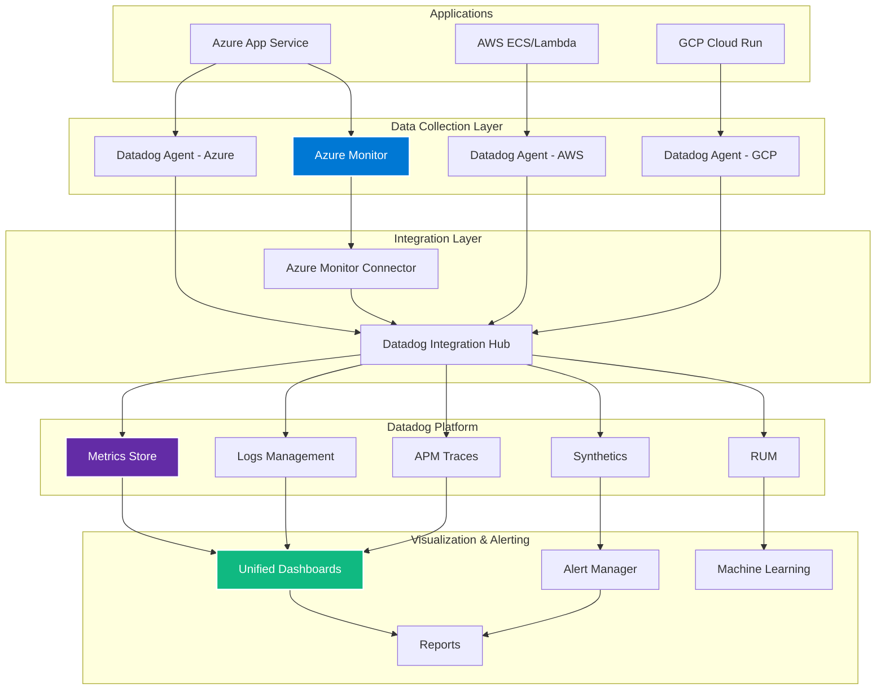
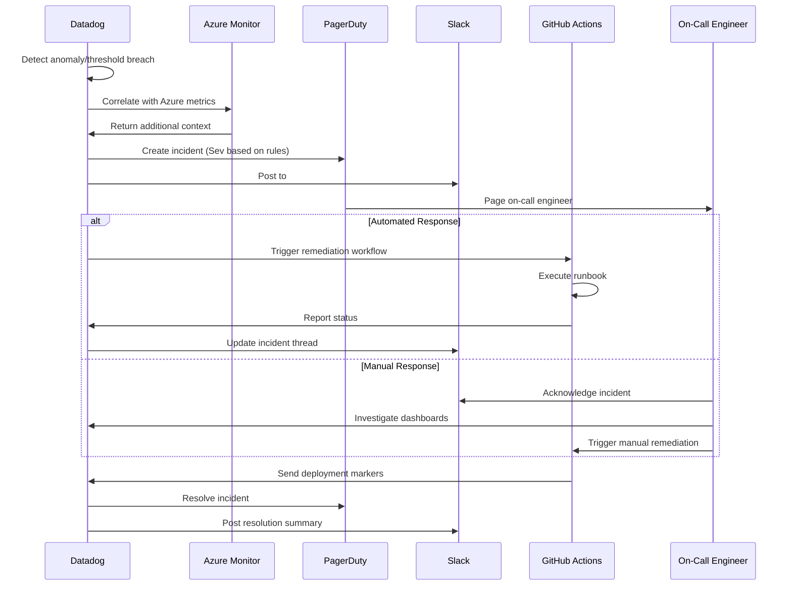

# 🔍 Multi-Cloud Observability Guide
## Unified Monitoring with Datadog & Azure Monitor

> **Complete observability solution for multi-cloud deployments across Azure, AWS, and Google Cloud**

---

## 📊 Overview

This guide provides a comprehensive observability strategy using Datadog as the primary monitoring platform, integrated with Azure Monitor for enhanced Azure-specific insights, enabling unified monitoring across all three major cloud providers.

### Key Benefits
- 🌐 **Unified Dashboard** - Single pane of glass for all clouds
- 🔄 **Real-time Monitoring** - Live metrics and alerts
- 📈 **Performance Insights** - APM and infrastructure metrics
- 🚨 **Intelligent Alerting** - ML-powered anomaly detection
- 📝 **Compliance Reporting** - Automated audit trails

---

## 🏗️ Architecture Overview



---

## 🚀 Quick Start

### Prerequisites
1. **Datadog Account** - [Sign up for free trial](https://www.datadoghq.com/free-datadog-trial/)
2. **Azure Subscription** - [Create free account](https://azure.microsoft.com/free/)
3. **API Keys** - Datadog API and Application keys
4. **Cloud CLI Tools** - Azure CLI, AWS CLI, gcloud

### Initial Setup
```bash
# Install Datadog CLI
pip install datadog

# Configure Datadog
export DD_API_KEY="your-api-key"
export DD_APP_KEY="your-app-key"
export DD_SITE="datadoghq.com"  # or datadoghq.eu for EU

# Verify connection
datadog-cli config validate
```

---

## 🔷 Azure Integration

### Step 1: Configure Azure Monitor

```bash
# Create Azure Monitor workspace
az monitor log-analytics workspace create \
  --resource-group figma-to-code-rg \
  --workspace-name figma-to-code-logs \
  --location eastus

# Get workspace ID and key
WORKSPACE_ID=$(az monitor log-analytics workspace show \
  --resource-group figma-to-code-rg \
  --workspace-name figma-to-code-logs \
  --query customerId -o tsv)

WORKSPACE_KEY=$(az monitor log-analytics workspace get-shared-keys \
  --resource-group figma-to-code-rg \
  --workspace-name figma-to-code-logs \
  --query primarySharedKey -o tsv)
```

### Step 2: Install Datadog Agent on Azure

```yaml
# azure-datadog-agent.yaml
apiVersion: apps/v1
kind: DaemonSet
metadata:
  name: datadog-agent
spec:
  selector:
    matchLabels:
      app: datadog-agent
  template:
    metadata:
      labels:
        app: datadog-agent
    spec:
      serviceAccountName: datadog-agent
      containers:
      - name: datadog-agent
        image: gcr.io/datadoghq/agent:latest
        env:
          - name: DD_API_KEY
            valueFrom:
              secretKeyRef:
                name: datadog-secret
                key: api-key
          - name: DD_SITE
            value: "datadoghq.com"
          - name: DD_LOGS_ENABLED
            value: "true"
          - name: DD_APM_ENABLED
            value: "true"
          - name: DD_PROCESS_AGENT_ENABLED
            value: "true"
          - name: DD_KUBERNETES_KUBELET_HOST
            valueFrom:
              fieldRef:
                fieldPath: status.hostIP
        volumeMounts:
          - name: dockersocket
            mountPath: /var/run/docker.sock
          - name: logpodpath
            mountPath: /var/log/pods
        resources:
          requests:
            memory: "256Mi"
            cpu: "200m"
          limits:
            memory: "512Mi"
            cpu: "400m"
      volumes:
        - name: dockersocket
          hostPath:
            path: /var/run/docker.sock
        - name: logpodpath
          hostPath:
            path: /var/log/pods
```

### Step 3: Azure Monitor to Datadog Integration

```python
# azure-monitor-datadog-sync.py
import os
from azure.monitor.query import LogsQueryClient
from azure.identity import DefaultAzureCredential
from datadog import initialize, api
import datetime

# Initialize Azure Monitor client
credential = DefaultAzureCredential()
logs_client = LogsQueryClient(credential)

# Initialize Datadog
options = {
    'api_key': os.environ['DD_API_KEY'],
    'app_key': os.environ['DD_APP_KEY']
}
initialize(**options)

# Query Azure Monitor
workspace_id = os.environ['AZURE_WORKSPACE_ID']
query = """
AppRequests
| where TimeGenerated > ago(5m)
| summarize 
    RequestCount = count(),
    AvgDuration = avg(DurationMs),
    P95Duration = percentile(DurationMs, 95),
    P99Duration = percentile(DurationMs, 99)
    by AppRoleName, bin(TimeGenerated, 1m)
"""

response = logs_client.query_workspace(
    workspace_id=workspace_id,
    query=query,
    timespan=datetime.timedelta(minutes=5)
)

# Send to Datadog
for table in response.tables:
    for row in table.rows:
        timestamp = row[0]
        app_name = row[1]
        metrics = [
            {
                'metric': f'azure.app.requests.count',
                'points': [(timestamp, row[2])],
                'tags': [f'app:{app_name}', 'cloud:azure']
            },
            {
                'metric': f'azure.app.duration.avg',
                'points': [(timestamp, row[3])],
                'tags': [f'app:{app_name}', 'cloud:azure']
            },
            {
                'metric': f'azure.app.duration.p95',
                'points': [(timestamp, row[4])],
                'tags': [f'app:{app_name}', 'cloud:azure']
            },
            {
                'metric': f'azure.app.duration.p99',
                'points': [(timestamp, row[5])],
                'tags': [f'app:{app_name}', 'cloud:azure']
            }
        ]
        
        api.Metric.send(metrics)
```

### Step 4: Azure App Service Integration

```bash
# Enable Application Insights
az monitor app-insights component create \
  --app figma-to-code-insights \
  --location eastus \
  --resource-group figma-to-code-rg \
  --application-type web

# Get instrumentation key
INSTRUMENTATION_KEY=$(az monitor app-insights component show \
  --app figma-to-code-insights \
  --resource-group figma-to-code-rg \
  --query instrumentationKey -o tsv)

# Configure App Service
az webapp config appsettings set \
  --name figma-to-code-workshop \
  --resource-group figma-to-code-rg \
  --settings \
    APPINSIGHTS_INSTRUMENTATIONKEY=$INSTRUMENTATION_KEY \
    ApplicationInsightsAgent_EXTENSION_VERSION=~3 \
    XDT_MicrosoftApplicationInsights_Mode=Recommended
```

---

## 🔶 AWS Integration

### AWS CloudWatch to Datadog

```yaml
# cloudformation-datadog-integration.yaml
AWSTemplateFormatVersion: '2010-09-09'
Description: 'Datadog AWS Integration'

Parameters:
  DatadogApiKey:
    Type: String
    NoEcho: true
    Description: Datadog API Key

Resources:
  DatadogIntegrationRole:
    Type: AWS::IAM::Role
    Properties:
      AssumeRolePolicyDocument:
        Version: '2012-10-17'
        Statement:
          - Effect: Allow
            Principal:
              AWS: arn:aws:iam::464622532012:root
            Action: sts:AssumeRole
            Condition:
              StringEquals:
                sts:ExternalId: !Ref DatadogApiKey
      ManagedPolicyArns:
        - arn:aws:iam::aws:policy/SecurityAudit
      Policies:
        - PolicyName: DatadogAWSIntegrationPolicy
          PolicyDocument:
            Version: '2012-10-17'
            Statement:
              - Effect: Allow
                Action:
                  - apigateway:GET
                  - autoscaling:Describe*
                  - budgets:ViewBudget
                  - cloudfront:GetDistributionConfig
                  - cloudfront:ListDistributions
                  - cloudtrail:DescribeTrails
                  - cloudtrail:GetTrailStatus
                  - cloudtrail:LookupEvents
                  - cloudwatch:Describe*
                  - cloudwatch:Get*
                  - cloudwatch:List*
                  - codedeploy:List*
                  - codedeploy:BatchGet*
                  - directconnect:Describe*
                  - dynamodb:List*
                  - dynamodb:Describe*
                  - ec2:Describe*
                  - ecs:Describe*
                  - ecs:List*
                  - elasticache:Describe*
                  - elasticache:List*
                  - elasticfilesystem:DescribeFileSystems
                  - elasticfilesystem:DescribeTags
                  - elasticloadbalancing:Describe*
                  - elasticmapreduce:List*
                  - elasticmapreduce:Describe*
                  - es:ListTags
                  - es:ListDomainNames
                  - es:DescribeElasticsearchDomains
                  - fsx:DescribeFileSystems
                  - fsx:ListTagsForResource
                  - health:DescribeEvents
                  - health:DescribeEventDetails
                  - health:DescribeAffectedEntities
                  - kinesis:List*
                  - kinesis:Describe*
                  - lambda:GetPolicy
                  - lambda:List*
                  - logs:DeleteSubscriptionFilter
                  - logs:DescribeLogGroups
                  - logs:DescribeLogStreams
                  - logs:DescribeSubscriptionFilters
                  - logs:FilterLogEvents
                  - logs:PutSubscriptionFilter
                  - logs:TestMetricFilter
                  - organizations:DescribeOrganization
                  - rds:Describe*
                  - rds:List*
                  - redshift:DescribeClusters
                  - redshift:DescribeLoggingStatus
                  - route53:List*
                  - s3:GetBucketLogging
                  - s3:GetBucketLocation
                  - s3:GetBucketNotification
                  - s3:GetBucketTagging
                  - s3:ListAllMyBuckets
                  - s3:PutBucketNotification
                  - ses:Get*
                  - sns:List*
                  - sns:Publish
                  - sqs:ListQueues
                  - states:ListStateMachines
                  - states:DescribeStateMachine
                  - support:DescribeTrustedAdvisor*
                  - support:RefreshTrustedAdvisorCheck
                  - tag:GetResources
                  - tag:GetTagKeys
                  - tag:GetTagValues
                  - xray:BatchGetTraces
                  - xray:GetTraceSummaries
                Resource: '*'

  DatadogLogForwarder:
    Type: AWS::Serverless::Application
    Properties:
      Location:
        ApplicationId: arn:aws:serverlessrepo:us-east-1:464622532012:applications/Datadog-Log-Forwarder
        SemanticVersion: 3.91.0
      Parameters:
        DdApiKey: !Ref DatadogApiKey
        DdSite: datadoghq.com
        FunctionName: datadog-log-forwarder
```

### ECS Task Definition with Datadog

```json
{
  "family": "figma-to-code-task",
  "taskRoleArn": "arn:aws:iam::account-id:role/ecsTaskRole",
  "executionRoleArn": "arn:aws:iam::account-id:role/ecsTaskExecutionRole",
  "networkMode": "awsvpc",
  "requiresCompatibilities": ["FARGATE"],
  "cpu": "1024",
  "memory": "2048",
  "containerDefinitions": [
    {
      "name": "figma-to-code-app",
      "image": "your-ecr-repo/figma-to-code:latest",
      "portMappings": [
        {
          "containerPort": 3000,
          "protocol": "tcp"
        }
      ],
      "environment": [
        {
          "name": "DD_AGENT_HOST",
          "value": "localhost"
        },
        {
          "name": "DD_TRACE_AGENT_PORT",
          "value": "8126"
        }
      ],
      "logConfiguration": {
        "logDriver": "awslogs",
        "options": {
          "awslogs-group": "/ecs/figma-to-code",
          "awslogs-region": "us-east-1",
          "awslogs-stream-prefix": "ecs"
        }
      }
    },
    {
      "name": "datadog-agent",
      "image": "public.ecr.aws/datadog/agent:latest",
      "environment": [
        {
          "name": "DD_API_KEY",
          "valueFrom": "arn:aws:secretsmanager:region:account-id:secret:dd-api-key"
        },
        {
          "name": "DD_SITE",
          "value": "datadoghq.com"
        },
        {
          "name": "ECS_FARGATE",
          "value": "true"
        },
        {
          "name": "DD_APM_ENABLED",
          "value": "true"
        },
        {
          "name": "DD_LOGS_ENABLED",
          "value": "true"
        }
      ],
      "logConfiguration": {
        "logDriver": "awslogs",
        "options": {
          "awslogs-group": "/ecs/datadog-agent",
          "awslogs-region": "us-east-1",
          "awslogs-stream-prefix": "ecs"
        }
      }
    }
  ]
}
```

---

## 🔵 Google Cloud Integration

### GCP Operations Suite to Datadog

```yaml
# gcp-datadog-exporter.yaml
apiVersion: apps/v1
kind: Deployment
metadata:
  name: datadog-gcp-exporter
spec:
  replicas: 1
  selector:
    matchLabels:
      app: datadog-gcp-exporter
  template:
    metadata:
      labels:
        app: datadog-gcp-exporter
    spec:
      serviceAccountName: datadog-exporter
      containers:
      - name: exporter
        image: gcr.io/datadoghq/gcp-exporter:latest
        env:
        - name: DD_API_KEY
          valueFrom:
            secretKeyRef:
              name: datadog-secret
              key: api-key
        - name: GOOGLE_APPLICATION_CREDENTIALS
          value: /var/secrets/google/key.json
        - name: GCP_PROJECT_ID
          value: "figma-to-code-workshop"
        - name: EXPORT_INTERVAL
          value: "60"
        volumeMounts:
        - name: google-cloud-key
          mountPath: /var/secrets/google
      volumes:
      - name: google-cloud-key
        secret:
          secretName: gcp-key
```

### Cloud Run Integration

```dockerfile
# Dockerfile with Datadog APM
FROM node:18-alpine

# Install Datadog tracer
RUN npm install --save dd-trace

# Copy application
WORKDIR /app
COPY package*.json ./
RUN npm ci --only=production
COPY . .

# Add Datadog initialization
RUN echo "require('dd-trace').init();" > dd-init.js

# Start with Datadog tracer
CMD ["node", "-r", "./dd-init.js", "server.js"]
```

```yaml
# cloud-run-service.yaml
apiVersion: serving.knative.dev/v1
kind: Service
metadata:
  name: figma-to-code-service
  annotations:
    run.googleapis.com/launch-stage: GA
spec:
  template:
    metadata:
      annotations:
        autoscaling.knative.dev/maxScale: '100'
        autoscaling.knative.dev/minScale: '1'
    spec:
      containers:
      - image: gcr.io/project-id/figma-to-code:latest
        env:
        - name: DD_AGENT_HOST
          value: datadog-agent.datadog.svc.cluster.local
        - name: DD_TRACE_AGENT_PORT
          value: "8126"
        - name: DD_SERVICE
          value: figma-to-code-service
        - name: DD_ENV
          value: production
        - name: DD_VERSION
          value: "1.0.0"
        - name: DD_LOGS_INJECTION
          value: "true"
        - name: DD_RUNTIME_METRICS_ENABLED
          value: "true"
        - name: DD_PROFILING_ENABLED
          value: "true"
```

---

## 📊 Unified Dashboards

### Multi-Cloud Infrastructure Dashboard

```json
{
  "title": "Figma-to-Code Multi-Cloud Infrastructure",
  "description": "Unified view of Azure, AWS, and GCP deployments",
  "widgets": [
    {
      "id": 1,
      "definition": {
        "title": "Request Rate by Cloud Provider",
        "type": "timeseries",
        "requests": [
          {
            "q": "sum:azure.app.requests.count{*} by {cloud}.as_rate()",
            "display_type": "line",
            "style": {
              "palette": "blue"
            }
          },
          {
            "q": "sum:aws.applicationelb.request_count{*} by {cloud}.as_rate()",
            "display_type": "line",
            "style": {
              "palette": "orange"
            }
          },
          {
            "q": "sum:gcp.loadbalancing.https.request_count{*} by {cloud}.as_rate()",
            "display_type": "line",
            "style": {
              "palette": "green"
            }
          }
        ]
      }
    },
    {
      "id": 2,
      "definition": {
        "title": "Response Time P95 Comparison",
        "type": "timeseries",
        "requests": [
          {
            "q": "avg:azure.app.duration.p95{*}",
            "display_type": "line"
          },
          {
            "q": "avg:aws.applicationelb.target_response_time.p95{*}",
            "display_type": "line"
          },
          {
            "q": "avg:gcp.loadbalancing.https.backend_latencies.p95{*}",
            "display_type": "line"
          }
        ]
      }
    },
    {
      "id": 3,
      "definition": {
        "title": "Error Rate by Cloud",
        "type": "query_value",
        "requests": [
          {
            "q": "sum:azure.app.requests.failed{*}.as_rate()",
            "aggregator": "avg"
          }
        ],
        "precision": 2,
        "text_align": "center"
      }
    },
    {
      "id": 4,
      "definition": {
        "title": "Cost Analysis",
        "type": "toplist",
        "requests": [
          {
            "q": "sum:azure.cost.actual{*} by {service}",
            "style": {
              "palette": "blue"
            }
          },
          {
            "q": "sum:aws.cost.actual{*} by {service}",
            "style": {
              "palette": "orange"
            }
          },
          {
            "q": "sum:gcp.cost.actual{*} by {service}",
            "style": {
              "palette": "green"
            }
          }
        ]
      }
    }
  ]
}
```

### Application Performance Dashboard

```hcl
# terraform-datadog-dashboard.tf
resource "datadog_dashboard" "apm_dashboard" {
  title       = "Figma-to-Code APM Dashboard"
  description = "Application performance across all clouds"
  layout_type = "ordered"

  widget {
    service_map_definition {
      title         = "Service Dependencies"
      title_size    = "16"
      title_align   = "left"
      service       = "figma-to-code"
      filters       = ["env:production"]
      color_scheme  = "datadog16"
    }
  }

  widget {
    trace_service_definition {
      title              = "Service Performance"
      title_size         = "16"
      title_align        = "left"
      env                = "production"
      service            = "figma-to-code"
      span_name          = "all"
      show_errors        = true
      show_latency       = true
      show_hits          = true
      show_distribution  = true
      show_resource_list = true
      size_format        = "large"
      display_format     = "three_column"
    }
  }

  widget {
    timeseries_definition {
      title       = "Request Latency by Endpoint"
      title_size  = "16"
      title_align = "left"
      show_legend = true
      legend_size = "0"
      
      request {
        q            = "avg:trace.express.request{env:production} by {resource_name}.rollup(avg, 60)"
        display_type = "line"
        
        style {
          palette    = "cool"
          line_type  = "solid"
          line_width = "normal"
        }
      }
      
      yaxis {
        scale        = "linear"
        include_zero = true
      }
    }
  }
}
```

---

## 🚨 Alerting Configuration

### Multi-Cloud Alert Rules

```python
# datadog-alerts.py
from datadog import initialize, api

# Initialize Datadog API
initialize(api_key=DD_API_KEY, app_key=DD_APP_KEY)

# Multi-cloud availability monitor
availability_monitor = {
    "name": "Multi-Cloud Service Availability",
    "type": "service check",
    "query": "\"http.can_connect\".over(\"*\").by(\"host\",\"cloud\").last(2).count_by_status()",
    "message": """
{{#is_alert}}
🚨 Service unavailable in {{cloud.name}}!
- Host: {{host.name}}
- Cloud: {{cloud.name}}
- Last seen: {{last_triggered_at}}

Please check:
1. Service health in {{cloud.name}} console
2. Network connectivity
3. Recent deployments

@slack-alerts @pagerduty
{{/is_alert}}

{{#is_recovery}}
✅ Service recovered in {{cloud.name}}
{{/is_recovery}}
""",
    "tags": ["service:figma-to-code", "team:platform"],
    "options": {
        "thresholds": {
            "critical": 2,
            "warning": 1
        },
        "notify_no_data": True,
        "no_data_timeframe": 10,
        "renotify_interval": 5
    }
}

# Create monitor
api.Monitor.create(**availability_monitor)

# Performance degradation monitor
performance_monitor = {
    "name": "Multi-Cloud Performance Degradation",
    "type": "query alert",
    "query": "avg(last_5m):avg:trace.express.request.duration{env:production} by {cloud} > 1000",
    "message": """
{{#is_alert}}
⚠️ Performance degradation detected in {{cloud.name}}!

Current latency: {{value}}ms (threshold: 1000ms)
Cloud: {{cloud.name}}

Recent changes:
- Check recent deployments
- Review resource utilization
- Analyze error logs

Dashboard: https://app.datadoghq.com/dashboard/abc-123-def

@slack-performance
{{/is_alert}}
""",
    "tags": ["service:figma-to-code", "severity:warning"],
    "options": {
        "thresholds": {
            "critical": 2000,
            "warning": 1000
        },
        "evaluation_delay": 60
    }
}

api.Monitor.create(**performance_monitor)

# Cost anomaly detection
cost_monitor = {
    "name": "Cloud Cost Anomaly Detection",
    "type": "query alert",
    "query": "avg(last_4h):anomalies(sum:azure.cost.actual{*} + sum:aws.cost.actual{*} + sum:gcp.cost.actual{*}, 'agile', 3) >= 1",
    "message": """
{{#is_alert}}
💰 Unusual cloud spending detected!

Anomaly detected in cloud costs.
Please review:
- Recent resource provisioning
- Autoscaling events
- Unused resources

Cost Dashboard: https://app.datadoghq.com/dashboard/cost-analysis

@slack-finance @email-platform-team
{{/is_alert}}
""",
    "tags": ["team:platform", "type:cost"],
    "options": {
        "threshold_windows": {
            "trigger_window": "last_4h",
            "recovery_window": "last_1h"
        }
    }
}

api.Monitor.create(**cost_monitor)
```

---

## 📈 SLO Configuration

### Service Level Objectives

```yaml
# slo-definitions.yaml
apiVersion: v1
kind: ConfigMap
metadata:
  name: datadog-slos
data:
  slos.json: |
    {
      "slos": [
        {
          "name": "API Availability",
          "description": "99.9% uptime for all API endpoints",
          "type": "monitor",
          "monitor_ids": [12345, 12346, 12347],
          "thresholds": [
            {
              "timeframe": "30d",
              "target": 99.9,
              "warning": 99.95
            },
            {
              "timeframe": "7d",
              "target": 99.9,
              "warning": 99.95
            }
          ],
          "tags": ["service:api", "team:platform"]
        },
        {
          "name": "Request Latency",
          "description": "95% of requests under 500ms",
          "type": "metric",
          "query": {
            "numerator": "sum:trace.express.request{env:production,duration:<500}.as_count()",
            "denominator": "sum:trace.express.request{env:production}.as_count()"
          },
          "thresholds": [
            {
              "timeframe": "30d",
              "target": 95.0,
              "warning": 97.0
            }
          ],
          "tags": ["service:api", "team:platform"]
        },
        {
          "name": "Error Rate",
          "description": "Less than 1% error rate",
          "type": "metric",
          "query": {
            "numerator": "sum:trace.express.request.errors{env:production}.as_count()",
            "denominator": "sum:trace.express.request{env:production}.as_count()"
          },
          "thresholds": [
            {
              "timeframe": "30d",
              "target": 99.0,
              "warning": 99.5
            }
          ],
          "tags": ["service:api", "team:platform"]
        }
      ]
    }
```

---

## 🔄 Automation Workflows

### Incident Response Automation



### Auto-Remediation Workflow

```yaml
# .github/workflows/auto-remediation.yml
name: Auto-Remediation

on:
  repository_dispatch:
    types: [datadog-alert]

jobs:
  diagnose:
    runs-on: ubuntu-latest
    outputs:
      action: ${{ steps.analyze.outputs.action }}
      
    steps:
      - name: Analyze Alert
        id: analyze
        run: |
          ALERT_TYPE="${{ github.event.client_payload.alert_type }}"
          CLOUD="${{ github.event.client_payload.cloud }}"
          SEVERITY="${{ github.event.client_payload.severity }}"
          
          if [[ "$ALERT_TYPE" == "high_memory" ]]; then
            echo "action=scale-up" >> $GITHUB_OUTPUT
          elif [[ "$ALERT_TYPE" == "high_latency" ]]; then
            echo "action=restart-service" >> $GITHUB_OUTPUT
          elif [[ "$ALERT_TYPE" == "high_error_rate" ]]; then
            echo "action=rollback" >> $GITHUB_OUTPUT
          else
            echo "action=notify-only" >> $GITHUB_OUTPUT
          fi

  remediate:
    needs: diagnose
    runs-on: ubuntu-latest
    if: needs.diagnose.outputs.action != 'notify-only'
    
    steps:
      - name: Checkout
        uses: actions/checkout@v4
        
      - name: Scale Up Resources
        if: needs.diagnose.outputs.action == 'scale-up'
        run: |
          CLOUD="${{ github.event.client_payload.cloud }}"
          
          case $CLOUD in
            azure)
              az webapp scale --name ${{ secrets.AZURE_APP_NAME }} \
                --resource-group ${{ secrets.AZURE_RG }} \
                --instance-count 5
              ;;
            aws)
              aws ecs update-service \
                --cluster ${{ secrets.AWS_CLUSTER }} \
                --service ${{ secrets.AWS_SERVICE }} \
                --desired-count 5
              ;;
            gcp)
              gcloud run services update ${{ secrets.GCP_SERVICE }} \
                --min-instances=5 \
                --max-instances=20
              ;;
          esac
          
      - name: Restart Service
        if: needs.diagnose.outputs.action == 'restart-service'
        run: |
          # Implement rolling restart logic
          echo "Restarting service in ${{ github.event.client_payload.cloud }}"
          
      - name: Rollback Deployment
        if: needs.diagnose.outputs.action == 'rollback'
        run: |
          # Implement rollback logic
          echo "Rolling back in ${{ github.event.client_payload.cloud }}"
          
      - name: Update Datadog
        if: always()
        run: |
          curl -X POST "https://api.datadoghq.com/api/v1/events" \
            -H "DD-API-KEY: ${{ secrets.DD_API_KEY }}" \
            -H "DD-APPLICATION-KEY: ${{ secrets.DD_APP_KEY }}" \
            -H "Content-Type: application/json" \
            -d '{
              "title": "Auto-remediation executed",
              "text": "Action: ${{ needs.diagnose.outputs.action }}\nCloud: ${{ github.event.client_payload.cloud }}\nStatus: ${{ job.status }}",
              "alert_type": "info",
              "tags": ["automation:remediation", "cloud:${{ github.event.client_payload.cloud }}"]
            }'
```

---

## 📊 Cost Optimization

### Multi-Cloud Cost Tracking

```python
# cost-optimization.py
import boto3
import pandas as pd
from azure.mgmt.costmanagement import CostManagementClient
from google.cloud import billing_v1
from datadog import initialize, api

class MultiCloudCostOptimizer:
    def __init__(self):
        self.dd_api = initialize(api_key=DD_API_KEY, app_key=DD_APP_KEY)
        
    def analyze_azure_costs(self):
        """Analyze Azure costs and send to Datadog"""
        client = CostManagementClient(credential, subscription_id)
        
        query = {
            "type": "Usage",
            "timeframe": "MonthToDate",
            "dataset": {
                "granularity": "Daily",
                "aggregation": {
                    "totalCost": {
                        "name": "Cost",
                        "function": "Sum"
                    }
                },
                "grouping": [
                    {"type": "Dimension", "name": "ServiceName"},
                    {"type": "Dimension", "name": "ResourceGroup"}
                ]
            }
        }
        
        result = client.query.usage(scope, query)
        
        # Send to Datadog
        for row in result.rows:
            api.Metric.send([{
                'metric': 'azure.cost.daily',
                'points': [(row[0], row[2])],
                'tags': [
                    f'service:{row[1]}',
                    f'resource_group:{row[2]}',
                    'cloud:azure'
                ]
            }])
    
    def analyze_aws_costs(self):
        """Analyze AWS costs using Cost Explorer"""
        ce = boto3.client('ce')
        
        response = ce.get_cost_and_usage(
            TimePeriod={
                'Start': start_date,
                'End': end_date
            },
            Granularity='DAILY',
            Metrics=['UnblendedCost'],
            GroupBy=[
                {'Type': 'DIMENSION', 'Key': 'SERVICE'},
                {'Type': 'TAG', 'Key': 'Environment'}
            ]
        )
        
        # Process and send to Datadog
        for result in response['ResultsByTime']:
            for group in result['Groups']:
                api.Metric.send([{
                    'metric': 'aws.cost.daily',
                    'points': [(result['TimePeriod']['Start'], 
                               float(group['Metrics']['UnblendedCost']['Amount']))],
                    'tags': [
                        f'service:{group["Keys"][0]}',
                        f'environment:{group["Keys"][1]}',
                        'cloud:aws'
                    ]
                }])
    
    def identify_optimization_opportunities(self):
        """Identify cost optimization opportunities"""
        opportunities = []
        
        # Check for idle resources
        idle_query = """
        avg(last_1h):avg:system.cpu.user{*} by {host,cloud} < 5
        """
        
        idle_hosts = api.Metric.query(
            from_time=int(time.time()) - 3600,
            to_time=int(time.time()),
            query=idle_query
        )
        
        for series in idle_hosts['series']:
            if series['pointlist'][-1][1] < 5:  # CPU < 5%
                opportunities.append({
                    'type': 'idle_resource',
                    'resource': series['scope'],
                    'recommendation': 'Consider downsizing or terminating',
                    'potential_savings': 'High'
                })
        
        return opportunities
```

---

## 🚀 GitHub Actions Deployment Workflows

This section provides complete GitHub Actions workflows for deploying each demo scenario with full observability integration. Each workflow includes:

- **Automated Testing** - Unit, integration, and smoke tests
- **Performance Monitoring** - Lighthouse scores sent to Datadog
- **Deployment Tracking** - Events and version tracking
- **Health Checks** - Post-deployment verification
- **Rollback Capability** - Automated rollback on failures

### Workflow Overview

| Workflow | Cloud Provider | Key Features |
|----------|---------------|--------------|
| **E-commerce** | Azure App Service | Product catalog, shopping cart, payment integration |
| **SaaS Dashboard** | AWS ECS | Real-time analytics, WebSocket, multi-tenant |
| **Agency Portfolio** | Google Cloud CDN | Static site, multi-region, RUM monitoring |
| **Travel Platform** | Azure + SQL | Database migrations, autoscaling, i18n |

### Complete E-commerce Deployment with Monitoring

```yaml
# .github/workflows/deploy-ecommerce.yml
name: Deploy E-commerce with Observability

on:
  push:
    branches: [main]
    paths:
      - 'apps/ecommerce/**'
      - '.github/workflows/deploy-ecommerce.yml'
  workflow_dispatch:

env:
  APP_NAME: figma-ecommerce
  DD_SERVICE: ecommerce-frontend
  DD_ENV: production

jobs:
  deploy-and-monitor:
    runs-on: ubuntu-latest
    
    steps:
      - name: Checkout code
        uses: actions/checkout@v4
      
      - name: Setup Node.js
        uses: actions/setup-node@v4
        with:
          node-version: '18'
          cache: 'npm'
      
      - name: Install dependencies
        run: |
          cd apps/ecommerce
          npm ci
      
      - name: Run tests with coverage
        run: |
          cd apps/ecommerce
          npm run test:coverage
          
      - name: Send test results to Datadog
        uses: datadog/synthetics-ci-github-action@v0.12.1
        with:
          api_key: ${{ secrets.DD_API_KEY }}
          app_key: ${{ secrets.DD_APP_KEY }}
          test_search_query: 'tag:ecommerce'
      
      - name: Build application
        run: |
          cd apps/ecommerce
          npm run build
          
      - name: Deploy to Azure
        uses: azure/webapps-deploy@v2
        with:
          app-name: ${{ env.APP_NAME }}
          package: apps/ecommerce/build
          
      - name: Create Datadog deployment event
        run: |
          curl -X POST "https://api.datadoghq.com/api/v1/events" \
            -H "DD-API-KEY: ${{ secrets.DD_API_KEY }}" \
            -H "DD-APPLICATION-KEY: ${{ secrets.DD_APP_KEY }}" \
            -H "Content-Type: application/json" \
            -d '{
              "title": "E-commerce Deployment",
              "text": "Deployed version ${{ github.sha }} to production",
              "alert_type": "info",
              "source_type_name": "GITHUB",
              "tags": [
                "service:${{ env.DD_SERVICE }}",
                "env:${{ env.DD_ENV }}",
                "version:${{ github.sha }}",
                "team:ecommerce"
              ]
            }'
      
      - name: Run smoke tests
        run: |
          cd apps/ecommerce
          npm run test:e2e:smoke
          
      - name: Update Datadog monitors
        run: |
          # Enable monitors after deployment
          python scripts/update_monitors.py --service ${{ env.DD_SERVICE }} --enable
```

### SaaS Dashboard Deployment with Metrics

```yaml
# .github/workflows/deploy-saas-dashboard.yml
name: Deploy SaaS Dashboard with Monitoring

on:
  push:
    branches: [main]
    paths:
      - 'apps/saas-dashboard/**'
  pull_request:
    branches: [main]
    paths:
      - 'apps/saas-dashboard/**'

jobs:
  build-test-deploy:
    runs-on: ubuntu-latest
    
    steps:
      - uses: actions/checkout@v4
      
      - name: Configure AWS credentials
        uses: aws-actions/configure-aws-credentials@v4
        with:
          aws-access-key-id: ${{ secrets.AWS_ACCESS_KEY_ID }}
          aws-secret-access-key: ${{ secrets.AWS_SECRET_ACCESS_KEY }}
          aws-region: us-east-1
      
      - name: Setup monitoring
        run: |
          # Install Datadog CI
          npm install -g @datadog/datadog-ci
          
          # Configure Datadog
          export DATADOG_API_KEY=${{ secrets.DD_API_KEY }}
          export DATADOG_APP_KEY=${{ secrets.DD_APP_KEY }}
      
      - name: Build and test
        run: |
          cd apps/saas-dashboard
          npm ci
          npm run lint
          npm run test:unit
          npm run build
          
      - name: Upload source maps to Datadog
        run: |
          cd apps/saas-dashboard
          datadog-ci sourcemaps upload ./build \
            --service=saas-dashboard \
            --release-version=${{ github.sha }} \
            --minified-path-prefix=https://dashboard.figma-to-code.com/
      
      - name: Deploy to AWS ECS
        run: |
          # Build Docker image
          docker build -t saas-dashboard:${{ github.sha }} .
          
          # Tag and push to ECR
          docker tag saas-dashboard:${{ github.sha }} \
            ${{ secrets.ECR_REGISTRY }}/saas-dashboard:${{ github.sha }}
          docker push ${{ secrets.ECR_REGISTRY }}/saas-dashboard:${{ github.sha }}
          
          # Update ECS service
          aws ecs update-service \
            --cluster production \
            --service saas-dashboard \
            --force-new-deployment
      
      - name: Monitor deployment
        uses: datadog/github-action@v1
        with:
          api-key: ${{ secrets.DD_API_KEY }}
          service: saas-dashboard
          version: ${{ github.sha }}
          env: production
          
      - name: Run integration tests
        run: |
          cd apps/saas-dashboard
          npm run test:integration -- --env=production
          
      - name: Performance testing
        run: |
          cd apps/saas-dashboard
          npm run lighthouse:ci
          
          # Send performance metrics to Datadog
          node scripts/send-perf-metrics.js
```

### Agency Portfolio Deployment with CDN

```yaml
# .github/workflows/deploy-agency-portfolio.yml
name: Deploy Agency Portfolio

on:
  push:
    branches: [main]
    paths:
      - 'apps/agency-portfolio/**'
  workflow_dispatch:
    inputs:
      environment:
        description: 'Deployment environment'
        required: true
        default: 'production'
        type: choice
        options:
          - production
          - staging

jobs:
  deploy-multi-region:
    runs-on: ubuntu-latest
    strategy:
      matrix:
        region: [us-east-1, eu-west-1, ap-southeast-1]
    
    steps:
      - uses: actions/checkout@v4
      
      - name: Setup Google Cloud
        uses: google-github-actions/setup-gcloud@v1
        with:
          service_account_key: ${{ secrets.GCP_SA_KEY }}
          project_id: ${{ secrets.GCP_PROJECT_ID }}
      
      - name: Build static site
        run: |
          cd apps/agency-portfolio
          npm ci
          npm run build:static
          
      - name: Deploy to Cloud Storage
        run: |
          gsutil -m rsync -r -d \
            apps/agency-portfolio/dist \
            gs://portfolio-${{ matrix.region }}/
            
      - name: Update Cloud CDN
        run: |
          gcloud compute url-maps invalidate-cdn-cache \
            portfolio-lb-${{ matrix.region }} \
            --path="/*" \
            --async
            
      - name: Configure Datadog RUM
        run: |
          # Update RUM application with new version
          curl -X PUT "https://api.datadoghq.com/api/v2/rum/applications/${{ secrets.DD_RUM_APP_ID }}" \
            -H "DD-API-KEY: ${{ secrets.DD_API_KEY }}" \
            -H "DD-APPLICATION-KEY: ${{ secrets.DD_APP_KEY }}" \
            -H "Content-Type: application/json" \
            -d '{
              "data": {
                "attributes": {
                  "name": "Agency Portfolio",
                  "type": "browser",
                  "version": "${{ github.sha }}"
                }
              }
            }'
      
      - name: Synthetic monitoring setup
        run: |
          # Create synthetic tests for each region
          datadog-ci synthetics run-tests \
            --apiKey ${{ secrets.DD_API_KEY }} \
            --appKey ${{ secrets.DD_APP_KEY }} \
            --config synthetics-${{ matrix.region }}.json
```

### Travel Platform Deployment with Database Migration

```yaml
# .github/workflows/deploy-travel-platform.yml
name: Deploy Travel Platform

on:
  push:
    branches: [main]
    paths:
      - 'apps/travel-platform/**'
      - 'infrastructure/travel/**'

env:
  AZURE_WEBAPP_NAME: travel-platform
  AZURE_RESOURCE_GROUP: travel-platform-rg
  NODE_VERSION: '18'

jobs:
  database-migration:
    runs-on: ubuntu-latest
    
    steps:
      - uses: actions/checkout@v4
      
      - name: Azure Login
        uses: azure/login@v1
        with:
          creds: ${{ secrets.AZURE_CREDENTIALS }}
      
      - name: Run database migrations
        run: |
          cd apps/travel-platform
          npm ci
          npm run db:migrate:production
          
      - name: Verify migration
        run: |
          npm run db:verify
          
      - name: Send migration event to Datadog
        run: |
          curl -X POST "https://api.datadoghq.com/api/v1/events" \
            -H "DD-API-KEY: ${{ secrets.DD_API_KEY }}" \
            -H "Content-Type: application/json" \
            -d '{
              "title": "Database Migration Completed",
              "text": "Successfully migrated database for Travel Platform",
              "alert_type": "success",
              "tags": ["service:travel-platform", "type:migration"]
            }'

  deploy-application:
    needs: database-migration
    runs-on: ubuntu-latest
    
    steps:
      - uses: actions/checkout@v4
      
      - name: Setup Node.js
        uses: actions/setup-node@v4
        with:
          node-version: ${{ env.NODE_VERSION }}
          cache: 'npm'
      
      - name: Install and build
        run: |
          cd apps/travel-platform
          npm ci
          npm run build:production
          
      - name: Install Datadog APM
        run: |
          cd apps/travel-platform
          npm install --save dd-trace
          
          # Add Datadog initialization
          echo "require('dd-trace').init({
            service: 'travel-platform',
            env: 'production',
            version: '${{ github.sha }}',
            logInjection: true,
            runtimeMetrics: true,
            profiling: true
          });" > dd-init.js
      
      - name: Deploy to Azure App Service
        uses: azure/webapps-deploy@v2
        with:
          app-name: ${{ env.AZURE_WEBAPP_NAME }}
          package: apps/travel-platform
          
      - name: Configure autoscaling
        run: |
          az monitor autoscale create \
            --resource-group ${{ env.AZURE_RESOURCE_GROUP }} \
            --resource ${{ env.AZURE_WEBAPP_NAME }} \
            --resource-type Microsoft.Web/serverFarms \
            --name travel-autoscale \
            --min-count 2 \
            --max-count 10 \
            --count 2
            
          az monitor autoscale rule create \
            --resource-group ${{ env.AZURE_RESOURCE_GROUP }} \
            --autoscale-name travel-autoscale \
            --condition "CpuPercentage > 70 avg 5m" \
            --scale out 1
            
      - name: Setup alerts
        run: |
          # Create Datadog monitors
          python scripts/create_monitors.py \
            --service travel-platform \
            --env production \
            --thresholds-file monitors/travel-platform.yaml
```

### Monitoring Pipeline for All Services

```yaml
# .github/workflows/monitoring-pipeline.yml
name: Unified Monitoring Pipeline

on:
  schedule:
    - cron: '*/15 * * * *'  # Every 15 minutes
  workflow_dispatch:

jobs:
  collect-metrics:
    runs-on: ubuntu-latest
    
    steps:
      - uses: actions/checkout@v4
      
      - name: Setup Python
        uses: actions/setup-python@v4
        with:
          python-version: '3.10'
          
      - name: Install dependencies
        run: |
          pip install datadog azure-monitor-query boto3 google-cloud-monitoring
          
      - name: Collect Azure metrics
        run: |
          python scripts/collect_azure_metrics.py \
            --services ecommerce,travel-platform \
            --metrics requests,errors,latency,cost
            
      - name: Collect AWS metrics
        run: |
          python scripts/collect_aws_metrics.py \
            --services saas-dashboard \
            --metrics cpu,memory,requests,errors
            
      - name: Collect GCP metrics
        run: |
          python scripts/collect_gcp_metrics.py \
            --services agency-portfolio \
            --metrics cdn_hits,latency,bandwidth
            
      - name: Calculate SLOs
        run: |
          python scripts/calculate_slos.py \
            --config slo-config.yaml \
            --output slo-report.json
            
      - name: Send to Datadog
        run: |
          python scripts/send_to_datadog.py \
            --metrics-file collected-metrics.json \
            --slo-file slo-report.json
            
      - name: Generate cost report
        run: |
          python scripts/generate_cost_report.py \
            --clouds azure,aws,gcp \
            --services all \
            --period last_24h
            
      - name: Check anomalies
        run: |
          python scripts/detect_anomalies.py \
            --sensitivity high \
            --services all \
            --alert-channel slack
```

### Rollback Workflow with Monitoring

```yaml
# .github/workflows/rollback-with-monitoring.yml
name: Automated Rollback

on:
  workflow_dispatch:
    inputs:
      service:
        description: 'Service to rollback'
        required: true
        type: choice
        options:
          - ecommerce
          - saas-dashboard
          - agency-portfolio
          - travel-platform
      version:
        description: 'Version to rollback to'
        required: true

jobs:
  rollback:
    runs-on: ubuntu-latest
    
    steps:
      - name: Validate rollback version
        run: |
          # Check if version exists
          echo "Validating version ${{ inputs.version }} for ${{ inputs.service }}"
          
      - name: Create rollback event
        run: |
          curl -X POST "https://api.datadoghq.com/api/v1/events" \
            -H "DD-API-KEY: ${{ secrets.DD_API_KEY }}" \
            -H "Content-Type: application/json" \
            -d '{
              "title": "Rollback Initiated",
              "text": "Rolling back ${{ inputs.service }} to version ${{ inputs.version }}",
              "alert_type": "warning",
              "tags": ["service:${{ inputs.service }}", "action:rollback"]
            }'
            
      - name: Disable monitors
        run: |
          # Temporarily disable monitors during rollback
          python scripts/manage_monitors.py \
            --service ${{ inputs.service }} \
            --action mute \
            --duration 30
            
      - name: Execute rollback
        run: |
          case "${{ inputs.service }}" in
            ecommerce)
              az webapp deployment slot swap \
                --name figma-ecommerce \
                --resource-group ecommerce-rg \
                --slot staging
              ;;
            saas-dashboard)
              aws ecs update-service \
                --cluster production \
                --service saas-dashboard \
                --task-definition saas-dashboard:${{ inputs.version }}
              ;;
            agency-portfolio)
              gsutil -m rsync -r -d \
                gs://portfolio-backup-${{ inputs.version }}/ \
                gs://portfolio-production/
              ;;
            travel-platform)
              az webapp deployment source config-zip \
                --name travel-platform \
                --resource-group travel-platform-rg \
                --src releases/${{ inputs.version }}.zip
              ;;
          esac
          
      - name: Verify rollback
        run: |
          # Run smoke tests
          npm run test:smoke:${{ inputs.service }}
          
      - name: Re-enable monitors
        run: |
          python scripts/manage_monitors.py \
            --service ${{ inputs.service }} \
            --action unmute
            
      - name: Update status
        run: |
          curl -X POST "https://api.datadoghq.com/api/v1/events" \
            -H "DD-API-KEY: ${{ secrets.DD_API_KEY }}" \
            -H "Content-Type: application/json" \
            -d '{
              "title": "Rollback Completed",
              "text": "Successfully rolled back ${{ inputs.service }} to version ${{ inputs.version }}",
              "alert_type": "success",
              "tags": ["service:${{ inputs.service }}", "action:rollback", "status:success"]
            }'
```

---

## 📜 Monitoring Scripts

### Update Monitors Script
```python
# scripts/update_monitors.py
import argparse
from datadog import initialize, api

def update_monitors(service, enable=True):
    """Enable or disable monitors for a service"""
    initialize(api_key=os.environ['DD_API_KEY'], app_key=os.environ['DD_APP_KEY'])
    
    # Get all monitors for the service
    monitors = api.Monitor.get_all(
        group_states="all",
        tags=[f"service:{service}"]
    )
    
    for monitor in monitors:
        if enable:
            api.Monitor.unmute(monitor['id'])
            print(f"Enabled monitor: {monitor['name']}")
        else:
            api.Monitor.mute(monitor['id'])
            print(f"Disabled monitor: {monitor['name']}")

if __name__ == "__main__":
    parser = argparse.ArgumentParser()
    parser.add_argument("--service", required=True)
    parser.add_argument("--enable", action="store_true")
    parser.add_argument("--disable", action="store_true")
    args = parser.parse_args()
    
    update_monitors(args.service, args.enable)
```

### Performance Metrics Script
```javascript
// scripts/send-perf-metrics.js
const { StatsD } = require('node-dogstatsd');
const lighthouse = require('lighthouse');
const chromeLauncher = require('chrome-launcher');

const dogstatsd = new StatsD();

async function runLighthouse(url) {
  const chrome = await chromeLauncher.launch({chromeFlags: ['--headless']});
  const options = {
    logLevel: 'info',
    output: 'json',
    onlyCategories: ['performance'],
    port: chrome.port
  };
  
  const runnerResult = await lighthouse(url, options);
  await chrome.kill();
  
  return runnerResult.lhr;
}

async function sendMetrics() {
  const url = process.env.APP_URL || 'http://localhost:3000';
  const results = await runLighthouse(url);
  
  // Send performance metrics to Datadog
  dogstatsd.gauge('lighthouse.performance.score', results.categories.performance.score * 100);
  dogstatsd.gauge('lighthouse.metrics.fcp', results.audits['first-contentful-paint'].numericValue);
  dogstatsd.gauge('lighthouse.metrics.lcp', results.audits['largest-contentful-paint'].numericValue);
  dogstatsd.gauge('lighthouse.metrics.tti', results.audits['interactive'].numericValue);
  dogstatsd.gauge('lighthouse.metrics.cls', results.audits['cumulative-layout-shift'].numericValue);
  
  console.log('Performance metrics sent to Datadog');
}

sendMetrics().catch(console.error);
```

### Create Monitors Script
```python
# scripts/create_monitors.py
import yaml
import argparse
from datadog import initialize, api

def create_monitors_from_config(service, env, config_file):
    """Create Datadog monitors from YAML configuration"""
    initialize(api_key=os.environ['DD_API_KEY'], app_key=os.environ['DD_APP_KEY'])
    
    with open(config_file, 'r') as f:
        config = yaml.safe_load(f)
    
    for monitor_config in config['monitors']:
        monitor = {
            "name": f"{service} - {monitor_config['name']}",
            "type": monitor_config['type'],
            "query": monitor_config['query'].format(service=service, env=env),
            "message": monitor_config['message'],
            "tags": [f"service:{service}", f"env:{env}"] + monitor_config.get('tags', []),
            "options": monitor_config.get('options', {})
        }
        
        result = api.Monitor.create(**monitor)
        print(f"Created monitor: {monitor['name']} (ID: {result['id']})")

if __name__ == "__main__":
    parser = argparse.ArgumentParser()
    parser.add_argument("--service", required=True)
    parser.add_argument("--env", required=True)
    parser.add_argument("--thresholds-file", required=True)
    args = parser.parse_args()
    
    create_monitors_from_config(args.service, args.env, args.thresholds_file)
```

### Collect Metrics Scripts
```python
# scripts/collect_azure_metrics.py
import argparse
from azure.monitor.query import MetricsQueryClient
from azure.identity import DefaultAzureCredential
from datadog import initialize, api

def collect_azure_metrics(services, metrics):
    credential = DefaultAzureCredential()
    client = MetricsQueryClient(credential)
    
    initialize(api_key=os.environ['DD_API_KEY'], app_key=os.environ['DD_APP_KEY'])
    
    for service in services.split(','):
        resource_id = f"/subscriptions/{os.environ['AZURE_SUBSCRIPTION_ID']}/resourceGroups/{service}-rg/providers/Microsoft.Web/sites/{service}"
        
        response = client.query_resource(
            resource_id,
            metric_names=metrics.split(','),
            timespan=timedelta(hours=1)
        )
        
        for metric in response.metrics:
            for time_series in metric.timeseries:
                for data_point in time_series.data:
                    if data_point.average is not None:
                        api.Metric.send([{
                            'metric': f'azure.{service}.{metric.name.lower()}',
                            'points': [(data_point.timestamp, data_point.average)],
                            'tags': [f'service:{service}', 'cloud:azure']
                        }])

if __name__ == "__main__":
    parser = argparse.ArgumentParser()
    parser.add_argument("--services", required=True)
    parser.add_argument("--metrics", required=True)
    args = parser.parse_args()
    
    collect_azure_metrics(args.services, args.metrics)
```

---

## 🔗 Official Documentation Links

### Datadog Resources
- [Datadog Documentation](https://docs.datadoghq.com/)
- [Azure Integration](https://docs.datadoghq.com/integrations/azure/)
- [AWS Integration](https://docs.datadoghq.com/integrations/amazon_web_services/)
- [GCP Integration](https://docs.datadoghq.com/integrations/google_cloud_platform/)
- [APM Setup](https://docs.datadoghq.com/tracing/)
- [Log Management](https://docs.datadoghq.com/logs/)
- [Dashboards](https://docs.datadoghq.com/dashboards/)
- [Monitors & Alerts](https://docs.datadoghq.com/monitors/)
- [API Reference](https://docs.datadoghq.com/api/latest/)

### Azure Monitor Resources
- [Azure Monitor Overview](https://docs.microsoft.com/en-us/azure/azure-monitor/)
- [Application Insights](https://docs.microsoft.com/en-us/azure/azure-monitor/app/app-insights-overview)
- [Log Analytics](https://docs.microsoft.com/en-us/azure/azure-monitor/logs/log-analytics-overview)
- [Azure Monitor REST API](https://docs.microsoft.com/en-us/rest/api/monitor/)
- [Datadog Azure Integration](https://docs.microsoft.com/en-us/azure/partner-solutions/datadog/)

### Cloud Provider Monitoring
- [AWS CloudWatch](https://docs.aws.amazon.com/cloudwatch/)
- [Google Cloud Operations](https://cloud.google.com/products/operations)
- [Azure Monitor Metrics](https://docs.microsoft.com/en-us/azure/azure-monitor/essentials/data-platform-metrics)

---

## 🎯 Best Practices

### 1. Tagging Strategy
```yaml
# Consistent tagging across all clouds
tags:
  # Required tags
  - environment: production|staging|development
  - service: figma-to-code
  - version: 1.0.0
  - cloud: azure|aws|gcp
  - region: us-east-1|eastus|us-central1
  - team: platform|frontend|backend
  
  # Optional tags
  - cost-center: engineering
  - project: workshop
  - owner: team-email@company.com
```

### 2. Log Aggregation
```javascript
// Structured logging format
const logger = require('winston');
const datadogWinston = require('datadog-winston');

logger.add(
  new datadogWinston({
    apiKey: process.env.DD_API_KEY,
    hostname: process.env.HOSTNAME,
    service: 'figma-to-code',
    ddsource: 'nodejs',
    ddtags: `env:${process.env.NODE_ENV},cloud:${process.env.CLOUD_PROVIDER}`,
  })
);

// Consistent log format
logger.info('Request processed', {
  requestId: req.id,
  userId: req.user.id,
  action: 'create_project',
  duration: responseTime,
  status: res.statusCode,
  cloud: process.env.CLOUD_PROVIDER
});
```

### 3. Custom Metrics
```python
# Custom business metrics
from datadog import statsd

# Track business KPIs
statsd.increment('figma.projects.created', tags=['cloud:azure'])
statsd.histogram('figma.conversion.time', conversionTime, tags=['step:design_to_code'])
statsd.gauge('figma.active.users', activeUsers, tags=['tier:premium'])

# Track feature usage
statsd.increment('figma.feature.usage', tags=['feature:ai_generation', 'cloud:aws'])
```

---

## 🚀 Getting Started Checklist

- [ ] Create Datadog account and get API keys
- [ ] Set up Azure Monitor workspace
- [ ] Configure cloud provider integrations
- [ ] Deploy Datadog agents to all environments
- [ ] Create unified dashboards
- [ ] Set up alerting rules
- [ ] Configure SLOs
- [ ] Implement auto-remediation workflows
- [ ] Set up cost tracking
- [ ] Train team on Datadog usage

---

## 🎯 Next Steps

**Your multi-cloud observability platform is ready!** Continue improving:

1. **Advanced APM** - Implement distributed tracing
2. **Security Monitoring** - Add SIEM capabilities
3. **Synthetic Monitoring** - Set up user journey tests
4. **RUM (Real User Monitoring)** - Track frontend performance

---

## 🗺️ Navigation

- **Related Guides**: [Deployment Guide](deployment_guide.md) | [Testing Guide](testing_guide.md)
- **Cloud Providers**: [Azure](https://azure.microsoft.com) | [AWS](https://aws.amazon.com) | [Google Cloud](https://cloud.google.com)
- **Monitoring Tools**: [Datadog](https://www.datadoghq.com) | [Azure Monitor](https://azure.microsoft.com/en-us/services/monitor/)

---

*Last Updated: January 2025*  
*Observability Guide Version: 1.0*

[🏠 Back to Main](../README.md) | [📚 All Guides](./) | [🔍 Monitor Your Success](#) 